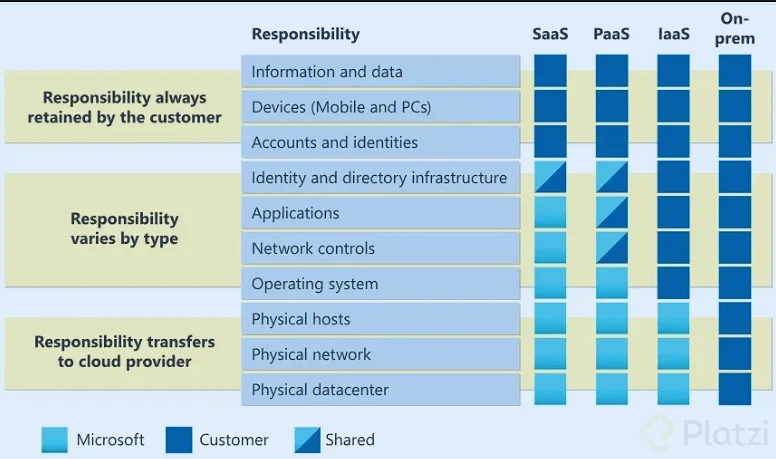

# 📘 Microsoft Azure Fundamentals (AZ-900) Course

> [Course content repository](https://github.com/platzi/AZ-900) - All course notes and materials in this repo

<a id="toc"></a>
## 🧭 Table of Contents (click to navigate)

- **[Class 2: Cloud Comparison - Private, Public & Hybrid](#class-2)**
- **[Class 3: Costs and Benefits of Azure Cloud Solutions](#class-3)**
- **[Class 4: How to Create an Azure Account Securely](#class-4)**
- **[Class 5: Installing Azure CLI + First Login](#class-5)**
- **[Class 6: Monitoring and Managing Your Costs in Azure](#class-6)**
- **[Class 7: Navigating the Azure Portal](#class-7)**
- **[Class 8: Azure Containers Category (Hidden Options)](#class-8)**
- **[Class 9: Improve Resource Management with Tags](#class-9)**
- **[Class 10: Storage Account + ARM Template Automation](#class-10)**
- **[Class 11: Why Automate Infrastructure? (Azure CLI Basics)](#class-11)**
- **[Class 12: Azure CLI + IaaS Lab](#class-12)**
- **[Class 13: PaaS in Azure (Cosmos DB, SQL, Web Apps)](#class-13)**
- **[Class 14: SaaS in Azure (WordPress Example)](#class-14)**
- **[Class 15: Choosing the Right Azure Region](#class-15)**
- **[Class 16: Scalability + High Availability](#class-16)**
- **[Class 17: Managing Subscriptions + Access (IAM/RBAC)](#class-17)**
- **[Class 18: Getting the Most from Access Control (Scopes + Least Privilege)](#class-18)**
- **[Class 19: Zero Trust for Cloud-Native Security](#class-19)**
- **[Class 20: Cloud Governance + TCO](#class-20)**
- **[Class 21: Managing Users in Azure (Microsoft Entra + Groups)](#class-21)**
- **[Class 22: Passwordless Authentication (Microsoft Entra ID)](#class-22)**
- **[Class 23: Non-Human Access with Service Principals (RBAC)](#class-23)**
- **[Class 24: Compute in Azure (VMs, Container Apps, Functions)](#class-24)**
- **[Class 25: VM Scale Sets (VMSS) + Autoscaling](#class-25)**
- **[Class 26: DNS Zones in Azure (Create + Manage)](#class-26)**
- **[Class 27: Public VM Networking (Public IP + NSG + Web Server)](#class-27)**
- **[Class 28: Azure Storage Basics (Accounts, Keys, Containers, Blobs)](#class-28)**
- **[Class 29: Azure Storage Access Tiers (Hot/Cool/Cold/Archive)](#class-29)**
- **[Class 30: Private Storage + VNets (Network Rules)](#class-30)**
- **[Class 31: Azure Bastion (Secure VM Access Without Public IPs)](#class-31)**
- **[Class 32: Microsoft Defender for Cloud](#class-32)**
- **[Class 33: Azure Policy (Custom Security Policies)](#class-33)**
- **[Class 34: Azure Cloud Shell (Bash/PowerShell in the Portal)](#class-34)**

---

<a id="class-2"></a>
## 🎓 Class 2: Cloud Comparison - Private, Public & Hybrid

⬅️ [Back to Table of Contents](#toc)

### ☁️ What is the Cloud and How Many Types Exist?

Cloud computing has become an indispensable tool in today's technological world. Understanding its capabilities and how its services are classified is essential to get the most out of it. Within the cloud concept, there are three major segments: **private cloud**, **public cloud**, and **hybrid cloud**. Each of these types offers different benefits and challenges that can influence the right solution for businesses or individuals.

---

### 🔒 What is Private Cloud?

The private cloud represents an environment where the infrastructure is exclusive to a single organization. Contrary to popular belief, it is not limited to just having physical servers in an office. A clear example is the ability to use a public cloud provider, like Azure, to create a private cloud. This allows, for example, creating a **VNet** that directly connects local devices with remote servers, ensuring privacy and exclusivity in communication.

#### ✅ Advantages of Private Cloud:

| Benefit | Description |
|---------|-------------|
| 🎛️ **Total Control** | Complete control over the infrastructure |
| 🛡️ **Enhanced Security** | Thanks to local storage and dedicated resources |
| 📋 **Regulatory Compliance** | Data remains within the company's network, meeting internal regulations |

---

### 🌐 What is Public Cloud?

The public cloud is offered by third parties, such as **Microsoft Azure**, **Amazon Web Services (AWS)**, and **Google Cloud**. These providers allow organizations to use shared resources maintained in massive data centers around the world.

#### ✅ Main Advantages of Public Cloud:

| Benefit | Description |
|---------|-------------|
| 📈 **Scalability** | Services can be increased or decreased according to demand |
| 💰 **Reduced Costs** | No need to maintain your own infrastructure, pay only for services used |
| 🌍 **Accessibility** | Services can be accessed from anywhere in the world |

#### ⚠️ Security Considerations:

> **Warning:** Organizations must consider security aspects. A configuration error can result in significant data breaches.

---

### 🔀 What is Hybrid Cloud?

The hybrid cloud is a combination of private and public clouds. It allows companies to maintain local controls while leveraging the scalability and additional services of the public cloud. A prominent example is the ability to host a local database and connect a web application in Azure that accesses that database.

#### ✅ Advantages of Hybrid Cloud:

| Benefit | Description |
|---------|-------------|
| 🔄 **Flexibility** | Combines the control of private cloud with the scalability of public |
| 📜 **Regulatory Compliance** | Allows keeping certain data locally, essential for governments requiring information to reside in their territory |
| ⚡ **Resource Optimization** | Efficient use of local environment and public cloud |

---

### 🤔 Which is the Best Option for You?

The choice between a private, public, or hybrid cloud depends on various factors such as:

- 🔐 **Security needs**
- 💵 **Budgets**
- ⚖️ **Legal requirements**

| Cloud Type | Best For |
|------------|----------|
| 🔒 **Private** | Total control and maximum security |
| 🌐 **Public** | Cost efficiency and scalability |
| 🔀 **Hybrid** | Balance between both worlds |

---

### 💡 Key Takeaways

> 🚀 Stay up to date with innovations and trends, as the world of cloud computing continues to evolve at an accelerated pace. Exploring and experimenting with these technologies will help you find the most suitable cloud solution for you or your organization.

---

### 📝 Class 2 Summary

```
┌─────────────────────────────────────────────────────────┐
│                    CLOUD TYPES                          │
├─────────────────────────────────────────────────────────┤
│  🔒 PRIVATE    │  Single org, full control, secure     │
│  🌐 PUBLIC     │  Shared resources, scalable, low cost │
│  🔀 HYBRID     │  Best of both worlds, flexible        │
└─────────────────────────────────────────────────────────┘
```

---

<a id="class-3"></a>
## 🎓 Class 3: Costs and Benefits of Azure Cloud Solutions

⬅️ [Back to Table of Contents](#toc)

### 💭 How Can a Cloud Solution Help You and When Can It Hurt You?

Starting with a cloud service can be exciting. The possibilities seem limitless: virtual machines with hundreds of gigs of RAM and terabytes of storage, powerful GPUs... It seems like a technological dream come true. However, these services come with a cost, and the cloud can easily become a financial burden if not managed properly.

---

### 🎯 Why is it Important to Evaluate Your Cloud Needs?

It's fundamental to understand the relationship between the services you acquire and their costs. The cloud is designed to improve your operations, but if not managed wisely, costs can exceed benefits:

| ⚠️ Common Pitfall | Description |
|-------------------|-------------|
| 🔧 **Excessive Configurations** | Opting for hardware configurations too powerful for your current needs can be a costly mistake |
| 💡 **Common Mistakes** | Like forgetting to turn off virtual machines, which can inflate your monthly costs |

> 📊 A correct evaluation will allow you to mitigate cost risks associated with using unnecessary resources.

---

### 🧮 How to Use the Azure Pricing Calculator to Plan Your Costs?

Microsoft Azure offers an invaluable platform to forecast and plan your costs: the **[Azure Pricing Calculator](https://azure.microsoft.com/pricing/calculator/)**. This resource becomes an essential tool for any company that wants total control over their cloud budget:

#### 🔍 Navigation and Selection

In the pricing calculator, you can choose from a vast catalog of services. The most common fields include:

- 🖥️ Virtual Machines
- 🗄️ Databases
- 💾 Storage

#### ⚙️ Virtual Machine Specifications

Here you define key parameters such as:

| Parameter | Options |
|-----------|---------|
| 💻 **Operating System** | Windows, Linux, etc. |
| ⚡ **Compute Type** | High performance or general use |
| 🌍 **Region** | Where it will be deployed |

#### 💵 Cost Estimates

You can calculate typical monthly costs based on usage hours. For example:

| Configuration | Estimated Monthly Cost |
|---------------|----------------------|
| 🚀 High-performance VM | ~$7,000/month |
| 👨‍💻 Basic developer setup | ~$11/month |

---

### 🔬 What Benefits Does Exploring Example Scenarios Offer?

Exploring example scenarios in the Azure calculator allows you to forecast architectures and costs associated with configurations you might not have considered:

#### 📋 Key Benefits:

| Benefit | Description |
|---------|-------------|
| 📊 **Common Scenario Analysis** | By selecting example scenarios, you can see predefined configurations for web applications or CI/CD architecture |
| 💰 **Simulated Budget** | By adding these configurations to your budget, you get a clear view of associated costs |
| 📤 **Data Export** | Finally, you can export estimated costs to an Excel file for sharing or later analysis |

---

### 🏆 Key Takeaways

> 💡 Using the Azure Pricing Calculator will not only help you plan and forecast costs, but it will also ensure you're using cloud technology in favor of your operations, maximizing benefits and keeping your finances under control.

#### ✅ Action Items:

- 🧮 **Always estimate costs** before deploying resources
- ⏰ **Set up auto-shutdown** for development VMs
- 📊 **Review usage regularly** to avoid surprise bills
- 🎯 **Right-size your resources** - don't over-provision

---

### 📝 Class 3 Summary

```
┌─────────────────────────────────────────────────────────┐
│              AZURE COST MANAGEMENT                      │
├─────────────────────────────────────────────────────────┤
│  🧮 CALCULATOR    │  Plan & forecast your expenses     │
│  ⚠️ PITFALLS      │  Over-provisioning, forgotten VMs  │
│  📊 SCENARIOS     │  Use examples to estimate costs    │
│  💰 EXPORT        │  Share estimates via Excel         │
└─────────────────────────────────────────────────────────┘
```

---

<a id="class-4"></a>
## 🎓 Class 4: How to Create an Azure Account Securely

⬅️ [Back to Table of Contents](#toc)

### 🔐 How to Create an Azure Account Securely?

Starting your Azure cloud journey can be exciting—and maybe a bit intimidating—especially when it comes to your account’s initial setup. Here’s a detailed, reliable guide to configure your Azure account securely and efficiently, while maximizing the benefits available to you.

---

### 🚀 What’s the First Step?

To begin, go to **[Azure Free Account / Free Services](https://azure.microsoft.com/es-es/free/)** and choose **“Try Azure for free”**. You’ll be asked to enter a valid email address, then follow a simple verification process.

For extra security, you may choose to receive a notification on your phone to confirm it’s really you signing in (a strong way to protect your account).

---

### 💳 What Should I Know About the Subscription?

When you create your account, Azure offers a **free subscription** with a **$200 USD credit**. This is typically enough to learn and experiment with the services used throughout the course.

You’ll also be asked to add a payment method (credit/debit card) to cover any usage that exceeds the free credit. In the context of this course, you shouldn’t need to spend beyond that credit if you follow the guidance and keep resources under control.

---

### 🛠️ Should I Add Technical Support?

During signup, Azure may offer you the option to add technical support. If you’re not planning to deploy high-impact or mission-critical solutions, it’s usually fine to skip paid support while you learn.

---

### 🌍 How Do I Configure My Account for Comfort?

After creating your account, Azure will show a quick tutorial. Spending a few minutes on it can help you understand the portal faster.

By default, Azure may appear in English, but you can change it easily:

- ⚙️ Go to **Settings**
- 🈯 Select **Language**
- 🇪🇸 Switch it to Spanish (or your preferred language)

---

### 🏁 Key Takeaways

> ✅ A secure setup from day one helps you learn confidently, reduces risk, and keeps your cloud experience smooth.

#### ✅ Action Items:

- 📱 Enable strong sign-in verification (phone prompt / MFA)
- 💳 Monitor your free credit so you don’t exceed it unintentionally
- 🧭 Take the portal tutorial to understand the basics faster
- 🌍 Set the portal language to what’s most comfortable for you

---

### 📝 Class 4 Summary

```
┌─────────────────────────────────────────────────────────┐
│            SECURE AZURE ACCOUNT SETUP                    │
├─────────────────────────────────────────────────────────┤
│  ✉️ SIGN UP       │  Use “Try Azure for free”           │
│  📱 VERIFY        │  Confirm sign-in for security        │
│  💳 CREDIT        │  $200 free credit (watch usage)      │
│  🌍 SETTINGS      │  Tutorial + language configuration   │
└─────────────────────────────────────────────────────────┘
```

---

<a id="class-5"></a>
## 🎓 Class 5: Installing Azure CLI (Windows, macOS, Ubuntu/Debian) + First Login

⬅️ [Back to Table of Contents](#toc)

### 🧾 Summary: How to Install Azure CLI on Different Operating Systems?

Managing your Azure subscription has never been easier. This class walks you step by step through installing the **Azure Command-Line Interface (Azure CLI)** so you can manage Azure from a terminal. 💻

This is especially useful if you’re a contributor (not the main subscription admin), because you might not see everything in the Azure Portal depending on permissions and roles—but with CLI you can still work efficiently with what you do have access to. 🔍

#### 🔗 Official installation guide

- 📘 **Microsoft Learn**: [Install Azure CLI](https://learn.microsoft.com/es-es/cli/azure/install-azure-cli?view=azure-cli-latest)

---

### 🪟 How to Install Azure CLI on Windows

- ⬇️ **Download the installer** from the class resources / official guide
- ▶️ **Run the installer** and follow the usual flow: *Next → Next → Next*

✅ Quick and painless.

---

### 🍎 How to Install on macOS (Homebrew)

If you use macOS, **Homebrew** makes installation simple:

- 🧑‍💻 **Run a single command** in your terminal (as provided in the official guide)

---

### 🐧 How to Install on Ubuntu and Debian

Just like macOS, installation on Ubuntu/Debian is straightforward:

- 🧩 **Run the install command/script** from the official guide
- ⚙️ The script will download and configure Azure CLI automatically

---

### ✅ How to Verify the Installation Worked

No matter which OS you’re using, open a terminal and run:

```bash
az
```

If installation is correct, you’ll see a long list of available commands. At the top, you’ll typically see the **Azure name in ASCII art**, which is a great sign everything is working. 🎉

---

### 🔐 How to Sign In to Azure from Azure CLI

After confirming the CLI works, sign in:

```bash
az login
```

This usually opens a browser to authenticate. If it doesn’t (or your environment is restricted), use device code login:

```bash
az login --use-device-code
```

Then:

- 🔢 **Copy the code** shown in your terminal
- 🌐 **Paste it into the webpage** that opens to complete authentication

---

### 🧭 Verify Subscriptions + Confirm Your Active Context

Once logged in, Azure CLI will list your accessible subscriptions. Choose the one you want to use, then verify your current selection:

```bash
az account show
```

✅ This confirms which subscription/account context you’re using—so you can confidently deploy resources from the portal or straight from the CLI. 🚀

---

### 📝 Class 5 Summary

```
┌─────────────────────────────────────────────────────────┐
│                    AZURE CLI BASICS                      │
├─────────────────────────────────────────────────────────┤
│  ⬇️ INSTALL       │  Windows / macOS / Ubuntu-Debian     │
│  ✅ VERIFY        │  Run `az` to confirm it works         │
│  🔐 LOGIN         │  `az login` / `--use-device-code`     │
│  🧾 CONTEXT       │  Check active subscription/account    │
└─────────────────────────────────────────────────────────┘
```

---

<a id="class-6"></a>
## 🎓 Class 6: Monitoring and Managing Your Costs in Azure

⬅️ [Back to Table of Contents](#toc)

### 🧾 Summary: How to Monitor and Manage Your Costs in Azure?

Cost management in Azure is a key skill for any IT professional. Estimating costs and keeping cloud resources under control helps you use your budget efficiently **and** maintain optimal system performance. While the Azure Pricing Calculator is a great starting point, real usage can differ—so learning where to monitor actual spend in the Azure Portal is essential. 💸📊

---

### 🔑 How to Access the Subscriptions Section in Azure

Go to the **Azure Portal** and open **Subscriptions**:

- 🔎 If you don’t see it right away, use the search bar and type **“Subscriptions”**
- 🗝️ You’ll land on the subscriptions page where you can view your available subscriptions and drill into details

---

### 📈 What Cost Information Can You See?

Inside the subscription view, Azure surfaces cost-related insights that help you stay on top of spending:

#### 📊 Cost charts

- 📉 You’ll see charts showing your **used amount** and **remaining amount** (when applicable)
- 🔮 Azure can also **project end-of-month costs** based on your current resource usage (a forward-looking estimate to prevent surprises)

#### 🧾 Resource breakdown

As you scroll down, you can identify:

- 🧱 Which resources are costing the most
- 🎯 Where you should investigate sizing, schedules, or cleanup

---

### ⚙️ How to Optimize Resource Management

Monitoring cost per resource is the best way to avoid unnecessary spend. When you see a resource driving high costs, check whether it’s over-sized compared to what you actually need.

Helpful ways to organize your review:

- 📍 **By location/region**
- 🏷️ **By resource name**
- 🗂️ **By resource group**

---

### 🛡️ What If You Find Unsecured Resources?

Any resource flagged as **not secure** should be reviewed and secured as a priority. 🚨  
Unsecured resources can introduce **security risk** and also **cost risk** (for example, unexpected usage due to exposure or misconfiguration).

---

### 💡 Does Azure Provide Personalized Recommendations?

Yes—Azure can provide recommendations based on how you’re using resources. For example:

- ⬆️ Suggesting a move from a **basic** plan to a **premium** plan if usage patterns justify it
- 🧠 Highlighting optimization opportunities to improve cost-efficiency

Following these recommendations (with good judgment) can help optimize both performance and cost. ✅

---

### 🧮 How to Set Budgets in Azure

In **Cost Management**, you’ll find **Budgets**—a feature that lets you set spending limits and receive notifications if you approach or exceed them. 🔔

Example:

- 🖥️ If you decide a VM shouldn’t exceed **$100/month**, you can create a budget and have Azure alert you as you near that threshold.

---

### 🏁 Key Takeaways

- 📊 Use **Subscriptions + Cost Management** to track real spend (not just estimates)
- 🧹 Periodically review for unused resources and delete what you don’t need
- 🎯 Right-size and organize resources to keep spending predictable
- 🔔 Set budgets early to avoid surprise bills

---

### 📝 Class 6 Summary

```
┌─────────────────────────────────────────────────────────┐
│                AZURE COST MONITORING                     │
├─────────────────────────────────────────────────────────┤
│  🔎 SUBSCRIPTIONS  │  Find costs + projections            │
│  🧾 BREAKDOWN      │  Identify top-cost resources          │
│  ⚙️ OPTIMIZE       │  Right-size + organize by groups      │
│  🔔 BUDGETS        │  Alerts when you approach limits      │
└─────────────────────────────────────────────────────────┘
```

---

<a id="class-7"></a>
## 🎓 Class 7: Navigating the Azure Portal

⬅️ [Back to Table of Contents](#toc)

### 🧾 Summary: How Do You Navigate the Azure Portal?

The Azure Portal is a powerful tool for managing and deploying cloud resources. With **nearly 200 services** available, it can feel overwhelming at first—and that’s completely normal. 😅  
In this class, you’ll learn how to navigate the portal and align Azure resources with your specific needs. 🧭

---

### 🧱 What Is the Azure Main Menu?

When you sign in to the Azure Portal, you’ll notice a **top (horizontal) menu** that helps you quickly access things you’ve used recently.

- 🕘 **Recent items**: jump back into the last services/resources you worked on
- ➕ **Create a resource**: a quick entry point to deploy new services fast
- 🎛️ **Personalization**: the portal adapts based on your usage, and you can customize what you pin and how you navigate

---

### 🔍 How Do You Explore Service Options?

Azure has many categories of ready-to-deploy services. In the portal, you can explore categories and also discover services you might not have used before.

Make sure to explore:

- 📚 **All services**: a complete list of resources organized by category (super helpful when you don’t know the exact name)

#### ⭐ Popular categories to know

- 🤖 **AI + Machine Learning**: Azure AI Foundry, Machine Learning
- 🗄️ **Databases**: Azure Cosmos DB, Azure SQL (e.g., Hyperscale)
- 📦 **Containers**: Container Instances, Container Registry

---

### 🎯 What Does “Specialization” Mean in Azure?

Azure is huge. It’s practically impossible to master every service—and that’s expected. ✅  
Instead, most professionals specialize in a domain, for example:

- 🗃️ **Data**
- 🧩 **Distributed applications**
- 🖥️ **Compute / infrastructure**

Specializing lets you go deep where it matters, without needing to know every single Azure product. 🧠

---

### 🔄 How Do You Stay Up to Date in Azure?

Azure changes constantly: new services appear, others evolve, and features get renamed or reorganized. Keeping up with everything is hard, so use a strategy:

- 🧭 Pick a category you care about
- 🧪 Deploy and experiment with services in that category
- 🧹 Delete resources when you’re done learning (to avoid cost surprises)

> 🧠 Experimentation is your best friend: deploy → learn → clean up.

---

### 🚀 Start Exploring!

With this, you’re ready to dive into Azure. Don’t worry if it feels like a lot in the beginning—practice will quickly make the portal feel familiar. 💪  
Explore, test, and iterate so you can choose the best tools for your projects. 🌩️

---

### 📝 Class 7 Summary

```
┌─────────────────────────────────────────────────────────┐
│                AZURE PORTAL NAVIGATION                   │
├─────────────────────────────────────────────────────────┤
│  🧱 MAIN MENU      │  Recent items + Create resource      │
│  📚 ALL SERVICES   │  Browse services by category         │
│  🎯 SPECIALIZE     │  Go deep in a domain                 │
│  🧪 EXPERIMENT     │  Deploy → learn → delete             │
└─────────────────────────────────────────────────────────┘
```

---

<a id="class-8"></a>
## 🎓 Class 8: What’s Hidden in the Azure Portal “Containers” Category?

⬅️ [Back to Table of Contents](#toc)

### 🧾 Summary: What Does the Azure Portal Hide in the Containers Category?

Exploring Azure can be exciting! 🎉 But here’s a key tip: sometimes there are **more services available than what the portal shows at first glance**. For example, when you open the **Containers** area in the Azure Portal, it may look like there are only a couple of options—but the broader Azure catalog reveals many more container-related services. 👀📦

#### 🔗 Azure Products catalog (official)

- 🧩 **Azure Products**: [Browse all Azure products](https://azure.microsoft.com/es-es/products)

---

### 📦 Where Can You Find All Available Container Services?

On the Azure Products site, services are organized similarly to the portal. When you select the **Containers** category, you’ll see **many more options** than what’s immediately visible in the portal UI.

Also note: some services can appear under multiple categories. For example, **Azure Kubernetes Service (AKS)** may show up in more than one place depending on how Microsoft groups services. That’s normal—and the catalog helps you find the “full list” faster. 🗂️✅

---

### 🚀 How to Get Started with Azure Container Apps

**Azure Container Apps** is a powerful and popular option in Azure. Once you select it from the catalog, you’ll typically find a richer set of resources such as:

- 🆚 Container comparisons
- ⚡ Quickstarts / getting-started guides
- 📘 Documentation links

This helps you learn faster and get the most out of both the portal and the online docs. 🧠

---

### 📚 Why Microsoft Learn Documentation Matters

Here’s a cool Azure reality: sometimes **documentation is available even before a product reaches general availability (GA)**. That often happens with services in **preview**—you can still access lots of learning material and references early. 🧪📄

Microsoft invests heavily in detailed documentation on **Microsoft Learn**, so you can explore deeply and be ready to implement new tools when they’re fully released. ✅

---

### 🧰 How Can Azure Documentation Help You?

Good docs don’t just describe products—they teach you how to use them:

- 🔮 Prepares you for upcoming releases
- 🏗️ Offers strategies and patterns for implementation
- 🧭 Gives you a reliable reference even while features evolve

---

### 💡 Recommendations to Get the Most Out of Azure

- 🧩 **Explore the full catalog** using the Azure Products link
- 📚 **Strengthen your knowledge with Microsoft Learn docs**
- 🎯 **Specialize in a favorite tool** (like Azure Container Apps) and go deep
- 🔄 **Stay current** by continuing your learning and experimenting

> 🚀 Azure has an impressive ecosystem of tools and documentation—keep exploring and you’ll always be one step ahead.

---

### 📝 Class 8 Summary

```
┌─────────────────────────────────────────────────────────┐
│                CONTAINERS IN AZURE                        │
├─────────────────────────────────────────────────────────┤
│  👀 HIDDEN OPTIONS  │  Portal shows some, catalog shows all │
│  🧩 PRODUCTS PAGE   │  Browse container services by category │
│  🚀 CONTAINER APPS  │  Quickstarts + comparisons + guides   │
│  📚 DOCS EARLY       │  Learn even during preview phases     │
└─────────────────────────────────────────────────────────┘
```

---

<a id="class-9"></a>
## 🎓 Class 9: Improve Resource Management in Azure with Tags

⬅️ [Back to Table of Contents](#toc)

### 🧾 Summary: How Can I Improve Resource Management in Azure with Tags?

In cloud environments—especially on platforms like Azure—keeping resources well-organized is critical. One simple (and often underrated) superpower is **tags**. 🏷️  
Tags help you categorize, search, govern, and manage resources at scale, making your Azure environment easier to understand and operate. 📌

---

### 🏷️ What Are Azure Tags and How Do You Create Them?

**Tags are metadata applied to Azure resources.** They are **key-value pairs** that help identify resources based on your own classification.

When you create a resource (for example, a **Resource Group**), you typically define:

- 🏷️ **Name**
- 🌍 **Region/location** (ideally close to the people/apps that will use it)

Then you can add **tags** as extra context.

Example:

- 📦 Resource group name: `my-first-rg`
- 🔑 Tag key: `environment`
- 🧪 Tag value: `testing`

This makes it instantly clear that the resources inside are meant for experiments or learning. ✅

> 💡 In the Azure Portal, tags often show in the resource overview. If you don’t see them immediately, it can sometimes be a UI/zoom/layout issue—scrolling or adjusting zoom may reveal the section.

---

### ⭐ Why Are Tags Important in Azure?

Tags help you:

- 🎯 **Understand purpose fast**: know what a resource is for without guessing
- 🧪 **Spot “temporary” resources**: identify volatile/learning resources (e.g., `testing`, `dev`)
- 🔎 **Search and filter efficiently**: quickly find and manage resources across your subscription(s)

---

### 🏢 What’s the Business Value of Tags?

Tags are extremely flexible—each organization can adapt them to its needs. Common enterprise patterns include:

- 🧪 **Environment**: `dev`, `test`, `prod`
- 👤 **Owner / team**: who is responsible for the resource
- 🧾 **Cost tracking**: `CostCenter`, `Client`, `Project`
- 🛡️ **Security classification**: `Confidential`, `Public`

Tags act like a compass in a large Azure estate—bringing clarity, governance, and better cost transparency. 🧭

---

### ⚠️ Important Notes (Microsoft Learn-style guidance)

- 🔑 **Tags are key-value pairs** used for identification and organization
- 📝 **Tags are stored as plain text** → **do not put secrets or sensitive data in tags**
- 🌐 **Be careful using non-English languages** in tags in some contexts (it can occasionally cause decoding/progress issues depending on tooling and integrations)
- 🔤 **Tag names are case-insensitive** for operations (treat `Owner` and `owner` as the same key)
- 🚫 **Tag names can’t contain certain characters**: `<`, `>`, `%`, `&`, `` ` ``, `?`, `/`

---

### 🎯 Best Uses of Tags in Azure

- 🏛️ **Organization & governance**: classify by environment, project, department
- 💸 **Cost control**: add `Owner` / `CostCenter` to track spend by team/client
- 🛡️ **Security & compliance**: classify sensitivity and enforce rules
- 🤖 **Automation & management**: filter/apply policies using **Azure Policy** or Automation based on tags

📌 Recommendation: define a clear convention (`key:value`), tag all important resources consistently, and avoid “tag spam” that no one maintains. ✅

---

### 📝 Class 9 Summary

```
┌─────────────────────────────────────────────────────────┐
│                    AZURE TAGS                            │
├─────────────────────────────────────────────────────────┤
│  🏷️ METADATA       │  Key-value pairs for resources       │
│  🔎 SEARCH          │  Filter & find resources fast        │
│  💸 COST            │  Track spend by owner/cost center    │
│  🛡️ GOVERNANCE      │  Enforce rules with policy/automation │
└─────────────────────────────────────────────────────────┘
```

---

<a id="class-10"></a>
## 🎓 Class 10: Create an Azure Storage Account + Automate Deployments with ARM Templates

⬅️ [Back to Table of Contents](#toc)

### 🧾 Summary: How Do I Create a Storage Account in Azure?

To start using Azure services, you create resources based on your needs. One foundational resource is a **Storage Account**, which lets you store data in Microsoft’s cloud. ☁️💾

---

### 🏗️ Create a Storage Account (Portal)

1. 🌐 Open the **Azure Portal** and select **Create**
2. 🔎 Search for **Storage account** (using your portal language helps)
3. 🧾 Select **Storage account** → **Create**
4. ✅ Fill in the required fields:
   - 🗂️ **Resource group**: select the one you’ll use for the course/lab
   - 🏷️ **Storage account name**: must be **globally unique**
   - 🌍 **Region**: preferably the same region as your resource group (and close to users)
   - ⚙️ **Performance**: choose **Standard** for learning environments
   - 💸 **Redundancy**: choose **Locally-redundant storage (LRS)** for the lowest cost option
5. 🔍 Click **Review + create**
6. 🚀 After validation passes, click **Create** → then **Go to resource**

---

### 🧩 Azure Naming Rules (Why Your Storage Account Name Might Fail)

Azure validates the storage account name automatically. For storage accounts, the name is similar to a domain-style identifier:

- ✅ Must be **unique**
- 🚫 No uppercase letters
- 🚫 Avoid special punctuation (Azure will reject invalid characters)

📌 For learning: stick to the cheapest defaults (Standard + LRS). Premium options can generate unnecessary costs. 💰

---

### 🤖 What Are ARM Templates (and Why Automate)?

After creating a resource, you can export its configuration as an **ARM template (Azure Resource Manager template)** to automate future deployments. This is extremely useful when you need to recreate similar resources repeatedly with small changes (like the name). 🔁

#### ✅ Why automation matters

- ⏱️ **Time savings**: no repeated clicking through forms
- 🧱 **Consistency**: same configuration every time
- 📈 **Scalability**: deploy many similar resources easily
- 🧾 **Version control**: templates can live in Git
- 🔄 **CI/CD ready**: integrate infra deployments into pipelines

> 🧠 The portal is great for learning, but manual deployment doesn’t scale. Automation is how real environments are built.

---

### 📤 Export an ARM Template from an Existing Resource

1. 📦 Open your **Storage account** resource
2. 🧭 In the left menu, go to **Automation** (or **Automation** section)
3. 📄 Select **Export template**
4. ⬇️ Download the ZIP (often named something like `ExportedTemplate.zip`)
5. 🗜️ Extract it—you’ll typically find:
   - `template.json` (full resource definition)
   - `parameters.json` (values you can change per deployment)

#### 🧪 Simplified ARM template example (`template.json`)

```json
{
  "$schema": "https://schema.management.azure.com/schemas/2019-04-01/deploymentTemplate.json#",
  "contentVersion": "1.0.0.0",
  "parameters": {
    "storageAccountName": {
      "type": "string",
      "metadata": {
        "description": "Storage account name"
      }
    }
  },
  "resources": [
    {
      "type": "Microsoft.Storage/storageAccounts",
      "apiVersion": "2021-04-01",
      "name": "[parameters('storageAccountName')]",
      "location": "centralus",
      "sku": { "name": "Standard_LRS" },
      "kind": "StorageV2"
    }
  ]
}
```

---

### ♻️ Reuse an ARM Template for New Deployments (Portal)

1. 🔎 Search for **Template deployment**
2. 🧩 Open it and choose **Build your own template in the editor**
3. ⬆️ Click **Load file** and upload your `template.json`
4. 💾 Click **Save**
5. 🧾 Fill in parameters (like a new unique storage account name) and deploy

---

### 💻 Deploy an ARM Template Using Azure CLI

Supporting docs:

- 📘 [az deployment group](https://learn.microsoft.com/en-us/cli/azure/deployment/group?view=azure-cli-latest)

Commands:

```bash
az login
az account set --subscription "YOUR_SUBSCRIPTION_NAME"

az deployment group create \
  --resource-group YOUR_RESOURCE_GROUP_NAME \
  --template-file path/to/template.json \
  --parameters path/to/parameters.json
```

✅ This automates repeat deployments—typically you only change parameters like the storage account name.

---

### 📝 Class 10 Summary

```
┌─────────────────────────────────────────────────────────┐
│          STORAGE ACCOUNT + AUTOMATION (ARM)              │
├─────────────────────────────────────────────────────────┤
│  💾 STORAGE         │  Standard + LRS for low-cost labs    │
│  🏷️ NAMING          │  Unique name, no uppercase/specials  │
│  📤 EXPORT ARM       │  Automation → Export template        │
│  ♻️ REDEPLOY         │  Template deployment / Azure CLI      │
└─────────────────────────────────────────────────────────┘
```

---

<a id="class-11"></a>
## 🎓 Class 11: Why Automate Infrastructure in Azure? (Azure CLI Basics)

⬅️ [Back to Table of Contents](#toc)

### 🧾 Summary: Why Do We Need to Automate Infrastructure in Azure?

Infrastructure automation isn’t just a trend—it’s a necessity in modern development environments. 🚀  
Think about scenarios like:

- 👩‍💻 Deploying infrastructure for **5 developers** before merging their work
- 👥 Scaling that process to **50 people**
- ⏰ Spinning up infrastructure **minutes before work starts** and shutting it down **at the end of the day**

When scale increases, manual work in the portal (and even template-heavy workflows) becomes painful. That’s where **Azure CLI (`az`)** becomes a powerful ally. 💻⚡

---

### 🛠️ How to Use Azure CLI to Create Resources

Azure CLI lets you create resources using simple commands.

#### 🗂️ Create a Resource Group

```bash
az group create -l eastus2 -n GrupoRecursosCLI
```

- 📍 `-l` / `--location`: Azure region (here: `eastus2`)
- 🏷️ `-n` / `--name`: resource group name

✅ This is the CLI equivalent of creating a resource group in the portal—done in seconds. The CLI returns a JSON payload describing the created resource.

#### 💾 Create a Storage Account

```bash
az storage account create -n cuentacliamin001 -g GrupoRecursosCLI -l eastus2 --sku Standard_LRS
```

- 🏷️ `-n` / `--name`: **globally unique** storage account name (tip: add numbers to avoid collisions)
- 🗂️ `-g` / `--resource-group`: where to deploy
- 📍 `-l` / `--location`: region
- 💸 `--sku Standard_LRS`: Standard performance + locally redundant storage (cost-friendly and great for labs)

---

### 🧭 How to Discover Available Commands and Parameters

When you’re starting out, the biggest question is usually “what flags do I need?” You have two main ways:

#### 🆘 Use built-in help

```bash
az --help
az storage --help
az storage account --help
```

This lets you “drill down” until you find the command and the required parameters. 🔎

#### 🌐 Use Microsoft Learn documentation

If you prefer a visual reference with examples, Microsoft Learn lists commands, required/optional parameters, and usage patterns.

Recommended resource:

- 📘 [Manage Azure resources using Azure CLI](https://learn.microsoft.com/es-es/azure/azure-resource-manager/management/manage-resources-cli)

---

### 🏁 Key Takeaways

- ⚡ Azure CLI reduces clicks and speeds up provisioning
- ✅ Automation improves consistency and reduces human error
- 📚 Built-in help + Microsoft Learn docs make discovery easy

---

### 📝 Class 11 Summary

```
┌─────────────────────────────────────────────────────────┐
│                 AZURE CLI AUTOMATION                     │
├─────────────────────────────────────────────────────────┤
│  🗂️ GROUP CREATE    │  `az group create`                  │
│  💾 STORAGE CREATE  │  `az storage account create`         │
│  🆘 HELP SYSTEM     │  `az ... --help`                     │
│  📘 DOCS            │  Learn examples + parameters         │
└─────────────────────────────────────────────────────────┘
```

---

<a id="class-12"></a>
## 🎓 Class 12: Using Azure from the Command Line (Azure CLI + IaaS Lab)

⬅️ [Back to Table of Contents](#toc)

### 🧾 Summary: How Do I Use Azure with the Command Line?

Azure is a powerful cloud platform, and **Azure CLI** is one of the best ways to manage resources efficiently—especially when you’re practicing **Infrastructure as a Service (IaaS)**. 💻☁️

---

### 🏗️ What Is Infrastructure as a Service (IaaS)?

IaaS lets you create and manage cloud infrastructure similarly to physical servers, but on-demand:

- 🖥️ Create **Virtual Machines** (like physical servers)
- 💾 Create **Storage Accounts** for large data workloads
- 🌐 Deploy **Virtual Networks (VNets)** to connect and isolate resources

---

### 🚀 Getting Started with Azure CLI (Core Commands)

#### 🗂️ 1) Create a Resource Group (to organize everything)

```bash
az group create --name GrupoRecursosIaaS --location eastus2
```

#### 🖥️ 2) Create a VM (Ubuntu example)

```bash
az vm create \
  --resource-group GrupoRecursosIaaS \
  --name iaas-vm-01 \
  --image Ubuntu2204 \
  --admin-username azureuser \
  --admin-password "REPLACE_WITH_A_STRONG_PASSWORD"
```

> 🔐 Tip: For real projects, prefer SSH keys over passwords. Never commit real passwords to Git.

#### 💾 3) Create a Storage Account (basic + low cost)

```bash
az storage account create \
  --name storageiaas001 \
  --resource-group GrupoRecursosIaaS \
  --location eastus2 \
  --sku Standard_LRS
```

#### 🌐 4) Create a Virtual Network (VNet + Subnet)

```bash
az network vnet create \
  --resource-group GrupoRecursosIaaS \
  --name IaaSVnet001 \
  --address-prefix 10.0.0.0/16 \
  --subnet-name IaaSSubnet001 \
  --subnet-prefixes 10.0.0.0/24
```

---

### 🧯 Common VM Error: SKU Not Available (Fix with `--size`)

Sometimes Azure returns an error like `SkuNotAvailable` because the default VM size (e.g., `Standard_DS1_v2`) isn’t available in your chosen region.

✅ Fix: specify a supported size explicitly, for example:

```bash
az vm create \
  --resource-group GrupoRecursosIaaS \
  --name iaas-vm-01 \
  --image Ubuntu2204 \
  --admin-username azureuser \
  --admin-password "REPLACE_WITH_A_STRONG_PASSWORD" \
  --size Standard_B1s
```

Example `Standard_B1s` characteristics:

- 🧠 CPUs: 1
- 🧮 RAM: ~1 GiB
- ⚡ Baseline CPU performance: ~10%

---

### 🔎 View Resources from the Terminal

```bash
az group list --output table
az vm list --output table
```

---

### 🧹 Clean Up to Avoid Unexpected Charges

At the end of each practice, delete the resource group (this deletes everything inside it):

```bash
az group delete --name GrupoRecursosIaaS --yes --no-wait
```

---

### 📚 Class Resources

The class command list is summarized here:

- 🧾 [GitHub script: `comandos.sh`](https://github.com/platzi/AZ-900/blob/main/azureIaaS/comandos.sh)

---

### 📝 Class 12 Summary

```
┌─────────────────────────────────────────────────────────┐
│                 AZURE CLI + IAAS LAB                     │
├─────────────────────────────────────────────────────────┤
│  🗂️ GROUP          │  Create a resource group             │
│  🖥️ VM             │  Create VM (add --size if needed)    │
│  💾 STORAGE         │  Standard_LRS for low-cost labs      │
│  🌐 NETWORK         │  VNet + subnet for isolation         │
│  🧹 CLEANUP         │  Delete RG to avoid charges          │
└─────────────────────────────────────────────────────────┘
```

---

<a id="class-13"></a>
## 🎓 Class 13: Platform as a Service (PaaS) in Azure (Cosmos DB, SQL, Web Apps)

⬅️ [Back to Table of Contents](#toc)

### 🧾 Summary: What Is Platform as a Service (PaaS) in Azure?

**Platform as a Service (PaaS)** is a big upgrade in how you deploy applications. Instead of managing servers (OS, ports, patches, web servers like Nginx/IIS/Apache), you focus on your app—and Azure handles the platform layer. 🚀

With Azure PaaS, you can launch services faster, reduce operational overhead, and scale more easily. ☁️⚙️

---

### 🌍 Before You Start: Register Required Resource Providers (One-time Setup)

Sometimes your subscription needs the provider registered before you can create certain resources. This has **no extra cost**—it’s an administrative enablement step. ✅

Register providers:

```bash
az provider register --namespace Microsoft.DocumentDB
az provider register --namespace Microsoft.Sql
az provider register --namespace Microsoft.Web
```

Check registration status (repeat per provider as needed):

```bash
az provider show -n Microsoft.DocumentDB --query "registrationState"
```

⏳ It can take a few minutes until the state becomes `Registered`.

---

### 🧩 How to Deploy a Non-Relational Database with Cosmos DB

**Azure Cosmos DB** is one of Azure’s flagship managed NoSQL services. Instead of spinning up a VM and installing a database manually, you can provision a managed database with a single command. 🗃️✨

```bash
az cosmosdb create --name cosmospaas123 --resource-group GrupoRecursosPaaS
```

---

### 🗄️ How to Create a Cloud SQL Server with Azure CLI

Creating an Azure SQL server via CLI avoids OS-level management and the “local install” headaches. ✅  
Use a strong admin username (avoid overly common usernames) and a strong password (don’t store it in git). 🔐

```bash
az sql server create \
  --location eastus2 \
  --resource-group GrupoRecursosPaaS \
  --name serverPaas006 \
  --admin-user sqladminuser \
  --admin-password "REPLACE_WITH_A_STRONG_PASSWORD"
```

---

### 🧱 What Is an App Service Plan (and Why Do You Need It)?

An **App Service Plan** is the “container” that defines the compute resources your Web App will run on (pricing tier, region, scaling).  
You **must create a plan first** before deploying a Web App. 📦✅

```bash
az appservice plan create -g GrupoRecursosPaaS -n aminWebPlan --location eastus2 --sku F1
```

---

### 🌐 How to Deploy a Web App in Azure

Once your plan exists, you can create a Web App without configuring a web server manually. 🎯

```bash
az webapp create -g GrupoRecursosPaaS -p aminWebPlan -n mypaaswebapp001
```

---

### ⚠️ Common Issue: “This region has quota of 0 instances…” (Fix)

You might see an error like:

> “This region has quota of 0 instances for your subscription. Try selecting different region or SKU.”

✅ Fix options:

- 🌍 **Switch region** (example: `westus`, `eastus`)
- 🧾 **Switch SKU** (example: `B1` instead of free tier)

Examples:

```bash
az appservice plan create -g GrupoRecursosPaaS -n aminWebPlan --location westus --sku F1
```

```bash
az appservice plan create -g GrupoRecursosPaaS -n aminWebPlan --location eastus --sku B1
```

---

### ⭐ Benefits of Using PaaS in Azure

- ✅ **Ease of use**: less infrastructure configuration
- 📈 **Scalability**: adjust resources to demand
- 💸 **Cost efficiency**: pay for what you use (choose the right tier)
- 🧰 **Simplified operations**: fewer backend maintenance tasks

---

### 📚 Class Resources

The commands used in this class are summarized here:

- 🧾 [GitHub script: `azurePaaS/comandos.sh`](https://github.com/platzi/AZ-900/blob/main/azurePaaS/comandos.sh)

---

### 📝 Class 13 Summary

```
┌─────────────────────────────────────────────────────────┐
│                    AZURE PAAS BASICS                     │
├─────────────────────────────────────────────────────────┤
│  🗃️ COSMOS DB       │  Managed NoSQL provisioning          │
│  🗄️ SQL SERVER      │  Create cloud SQL without OS mgmt    │
│  🧱 APP PLAN         │  Required container for Web Apps     │
│  🌐 WEB APP          │  Deploy apps without web servers     │
│  🧾 PROVIDERS        │  Register DocumentDB/Sql/Web         │
└─────────────────────────────────────────────────────────┘
```

---

<a id="class-14"></a>
## 🎓 Class 14: Software as a Service (SaaS) in Azure (WordPress Example)

⬅️ [Back to Table of Contents](#toc)

### 🧾 Summary: What Is the SaaS Model in Cloud Computing?

**Software as a Service (SaaS)** is the most “hands-off” and convenient cloud model. Instead of provisioning servers, opening ports, installing software, and maintaining updates, you essentially **consume a ready-to-use application**. ✨

Example: launching a WordPress site.

- 🧱 Traditional approach: VM → install web server → configure WordPress → patch/maintain
- 🪄 SaaS approach: a few clicks → WordPress is provisioned and ready

---

### 🧩 Shared Responsibility Model (Where SaaS Fits)

This diagram shows how responsibilities shift across **On-prem → IaaS → PaaS → SaaS** (customer vs provider vs shared):



---

### 📝 How to Configure a WordPress Site with SaaS in Azure

You don’t need to be a developer or a server admin to do this. 👇

1. 🌐 Go to the **Azure Portal** and click **Create a resource**
2. 🔎 Search for **WordPress** and select the option provided by **Microsoft** (recommended templates)
3. 🗂️ Create/select a Resource Group (example name: `GrupoSaaS`)
4. ⚙️ Complete the configuration:
   - 🌍 Choose a site name (this becomes part of the URL)
   - 📦 Select a hosting plan
   - 🗣️ Choose site language
   - 🔐 Configure admin credentials
   - 🧩 Enable required add-ons if prompted (e.g., managed identities, Azure communication services)
5. ✅ Click **Review + create** → then **Create**

In a few minutes, Azure will deploy and configure the underlying resources and your WordPress site will be ready. 🚀

---

### ✅ Benefits of Using SaaS to Deploy Applications

- ⚡ **Speed & simplicity**: near-instant setup with minimal steps
- 🏭 **Industry-ready solutions**: many SaaS offerings come preconfigured for specific industries
- 🧰 **Less technical overhead**: provider handles servers, databases, and often licensing
- 📈 **Easy scaling**: grow as your traffic and needs grow

---

### 🧱 What Resources Can a SaaS Deployment Create Behind the Scenes?

Even if you click “Create” once, a SaaS solution can provision multiple components automatically, such as:

- 🌐 **Networking**: CDN, DNS zones, network components
- 🛡️ **Security & management**: secure endpoints, managed identities, access controls
- ⚙️ **Operational services**: monitoring/telemetry depending on the offer

---

### 🧠 Best Practices When Working with SaaS

- 🗂️ **Use resource groups** to keep deployments organized
- 🔍 **Review resources periodically** and remove what you don’t use (optimize cost)
- 🔐 **Keep access secure**: review identities/permissions regularly

---

### 📝 Class 14 Summary

```
┌─────────────────────────────────────────────────────────┐
│                     SAAS IN AZURE                         │
├─────────────────────────────────────────────────────────┤
│  🪄 FAST DEPLOY     │  Apps ready with minimal setup       │
│  🧩 RESPONSIBILITY  │  Provider owns more in SaaS          │
│  🗂️ ORGANIZATION     │  Use resource groups                │
│  🔐 SECURITY         │  Review identities & access         │
└─────────────────────────────────────────────────────────┘
```

---

<a id="class-15"></a>
## 🎓 Class 15: Choosing the Right Region for Your Azure Datacenters

⬅️ [Back to Table of Contents](#toc)

### 🧾 Summary: How Do I Choose the Right Region for My Datacenters?

Choosing an Azure region isn’t just about “closest to me.” With **dozens of Azure regions** and **hundreds of datacenters** globally, region selection becomes a strategic decision that impacts **latency**, **compliance**, **availability**, and **service features**. 🌍⚡

---

### 🗺️ Where Can I Find Official Datacenter/Region Information?

Two great starting points:

- 🌐 **Interactive globe** (regions + details): [Microsoft Datacenters - Explore the globe](https://datacenters.microsoft.com/globe/explore/)
- 🧭 **Azure Global Infrastructure** overview: [Azure global infrastructure](https://azure.microsoft.com/es-es/explore/global-infrastructure)

These views help you validate:

- 📍 Region locations
- 🏅 Certifications/compliance info
- 🗓️ When regions opened (helpful historical context)
- 🧩 Whether regions support Availability Zones (where applicable)

Extra (handy reference list):

- 🏷️ [Current Azure region names reference](https://azuretracks.com/2021/04/current-azure-region-names-reference/)

---

### 🏅 Why Do Datacenter Certifications Matter?

Certifications help ensure datacenters meet standards for **security**, **quality**, and sometimes **energy efficiency**. 🔐  
If you handle sensitive data or regulated workloads, choosing regions with the right certifications can be critical.

---

### 👥 How to Choose a Region Based on Your Audience

Your end users’ location is often the #1 driver for great UX:

- 📱 If your users are in Asia, placing workloads closer to them can reduce latency—even if your team sits in another country.
- ⚡ Lower latency typically means faster page loads and better responsiveness.

---

### 🧩 How Service Availability Influences Region Choice

Not every Azure service is available in every region. Some features may be:

- ✅ Generally available (GA)
- 🧪 In public preview
- 🚫 Not available at all in a given region

So your region choice should balance:

- 📍 proximity to users
- 🧰 required service availability
- 🏅 compliance/certification needs

---

### 🧾 Recommendations (Region Selection Checklist)

- 🏅 **Check certifications** when security/compliance is a priority
- 👥 **Pick regions close to users** to reduce latency
- 🧩 **Verify services are available** in your target region(s)
- ⚖️ **Balance cost, performance, and requirements** (don’t optimize only for distance)

---

### 📝 Class 15 Summary

```
┌─────────────────────────────────────────────────────────┐
│               AZURE REGION SELECTION                      │
├─────────────────────────────────────────────────────────┤
│  👥 USERS          │  Choose regions near your audience    │
│  🧩 SERVICES       │  Ensure required services exist       │
│  🏅 COMPLIANCE     │  Validate certifications/requirements │
│  🗺️ TOOLS          │  Use globe + infra pages             │
└─────────────────────────────────────────────────────────┘
```

---

<a id="class-16"></a>
## 🎓 Class 16: Scalability in the Cloud (Vertical, Horizontal) + High Availability

⬅️ [Back to Table of Contents](#toc)

### 🧾 Summary: What Is Scalability in the Cloud and How Do You Implement It?

Scalability is one of the most important cloud benefits. It means your application can handle more load by adjusting the resources it uses—without redesigning everything from scratch. 📈☁️

In Azure, scalability becomes much more accessible because you can scale up/down or out/in based on real demand. ✅

Class commands reference:

- 🧾 [GitHub script: `escalabilidad/comandos.sh`](https://github.com/platzi/AZ-900/blob/main/escalabilidad/comandos.sh)

---

### ⬆️ Vertical Scaling (Scale Up)

**Vertical scalability** means giving **one instance** more power (CPU/RAM). Think: “bigger machine.” 🧠💪

Typical App Service flow (examples):

```bash
az group create --name grupo-recursos-escalables --location eastus
az appservice plan create --name myAppServicePlan --resource-group grupo-recursos-escalables --sku P1v2
az webapp create --resource-group grupo-recursos-escalables --plan myAppServicePlan --name myUniqueAppName
```

Then you can move the plan/tier to get more compute (depending on the service). 📦

---

### ➡️ Horizontal Scaling (Scale Out)

**Horizontal scalability** means adding **more instances** (replicas) of the same app/service to share the traffic. Think: “more machines.” 🧩🧩🧩

In Azure, you can configure **autoscale rules**, for example:

- 🔥 Add an instance when CPU > **70%**
- 🧊 Remove an instance when CPU drops below a threshold

This is ideal for traffic spikes because it keeps performance stable without overpaying all month. ⚡💸

---

### 🟦 High Availability (HA) + Zone Redundancy

**High availability** means your app stays reachable even if parts of the infrastructure fail. 🛡️

One common strategy is distributing instances across **Availability Zones** inside a region:

- 🏢 “Zone redundancy enabled” means instances are deployed across multiple datacenter zones
- ✅ If one zone fails, others can continue serving traffic
- 📌 Some plans require a minimum number of instances (often **3**) to support zone redundancy

---

### 🧠 Key Definitions

- **Instance**: a running copy/replica of your app or service (used for horizontal scaling).
- **Zone redundancy**: distribution across multiple zones to improve resilience inside a region.

---

### 🧹 Cost Tip: Always Clean Up

Scaling is powerful, but leaving resources running can cause surprise charges. After practice, delete what you don’t need. 🧾

Example:

```bash
az group delete --name grupo-recursos-escalables --yes --no-wait
```

---

### 📝 Class 16 Summary

```
┌─────────────────────────────────────────────────────────┐
│            SCALABILITY + HIGH AVAILABILITY               │
├─────────────────────────────────────────────────────────┤
│  ⬆️ VERTICAL        │  More CPU/RAM for one instance       │
│  ➡️ HORIZONTAL      │  More instances (replicas)           │
│  🟦 ZONE REDUNDANCY │  Instances across multiple zones     │
│  🧹 CLEANUP         │  Delete resources to avoid costs     │
└─────────────────────────────────────────────────────────┘
```

---

<a id="class-17"></a>
## 🎓 Class 17: Managing Azure Subscriptions Effectively (Access Control / IAM)

⬅️ [Back to Table of Contents](#toc)

### 🧾 Summary: How Do I Manage Azure Subscriptions Effectively?

In real-world Azure environments, managing a subscription isn’t just about creating resources—it’s also about **controlling who can do what**. Many organizations have a dedicated subscription admin, but it’s still essential to understand access control—especially if you *are* the admin. 🔐

Azure uses **RBAC (Role-Based Access Control)** via **Access control (IAM)** to assign permissions at different scopes (subscription, resource group, resource). ✅

---

### 🗂️ Create a Resource Group (Good Practice for Organization)

A **resource group** is a container for related Azure resources (databases, storage, web apps, etc.). 📦

Steps (portal):

- 🌐 Sign in to the **Azure Portal**
- 🗂️ Go to **Resource groups** → **Create**
- 🏷️ Choose a name (example: `rg-doomsday-5`)
- 📍 Select a region (example: `East US 2`)
- 🏷️ Add tags if needed (e.g., `owner=email@domain.com`, `environment=dev`)

---

### 🧑‍⚖️ What Is Azure Access Control (IAM)?

**Access control (IAM)** is where you:

- 👀 **View your access** (confirm you have admin rights at the chosen scope)
- ➕ **Add role assignments** (grant users/groups permissions)
- 🧩 Control access with least privilege (give only what’s needed)

---

### ➕ How to Assign Roles to Users (RBAC)

To grant access to a resource group:

- 🗂️ Open the **resource group**
- 🔐 Go to **Access control (IAM)**
- ➕ Select **Add** → **Add role assignment**
- 🎭 Choose a role (common example: **Contributor**)
- 👤 Select the member(s) (user, group, service principal)
- ✅ Review + assign

📌 Tip: Prefer the smallest scope that works (resource group is often better than subscription-wide). 🎯

---

### ✅ Benefits of Managing Access Properly

- 🛡️ **Better security**: reduced blast radius
- 🧠 **Cleaner administration**: clear ownership and responsibilities
- 🔄 **Flexibility**: quickly adjust access as projects change

---

### 🔎 After Assigning Roles: Quick Verification

- 🔄 Refresh the portal (sometimes a hard refresh helps: `Ctrl + F5`)
- 👀 Reopen the resource group and confirm the role assignment appears
- 🧪 Test by creating a simple resource (e.g., a Storage Account) to validate permissions

---

### 🆘 Troubleshooting: The User Email Doesn’t Show Up in “Select members”

If the email you enter doesn’t appear (or Azure says it doesn’t exist), check:

- ✅ The email is correct and the user actually exists in your **tenant directory** (Microsoft Entra ID)
- 🏢 The user is in the **same organization/tenant** (personal emails like Gmail may not exist in the directory unless invited as guests)
- 🔎 Try searching by **display name** if they’re in the same tenant and the email isn’t searchable

---

### 📝 Class 17 Summary

```
┌─────────────────────────────────────────────────────────┐
│         SUBSCRIPTIONS + ACCESS CONTROL (IAM/RBAC)         │
├─────────────────────────────────────────────────────────┤
│  🗂️ RESOURCE GROUP  │  Organize resources by project       │
│  🔐 IAM / RBAC       │  Control who can do what             │
│  🎭 ROLES            │  Assign Contributor/Reader/etc.      │
│  🆘 TROUBLESHOOT     │  Member not found → check tenant     │
└─────────────────────────────────────────────────────────┘
```

---

<a id="class-18"></a>
## 🎓 Class 18: Getting the Most from Access Control in Azure

⬅️ [Back to Table of Contents](#toc)

### 🧾 Summary: How Can I Take Advantage of Access Control in Azure?

Access management in Azure gives you a powerful toolbox to control permissions precisely. At first it can feel complex—but it’s absolutely learnable with the right mental model. 🧠🔐  
Azure access control lets you grant permissions at different **scopes**, from a whole subscription down to a single resource.

---

### 🔐 What Is Access Control in Azure?

Azure uses **RBAC (Role-Based Access Control)** to define what a user/group/service can do. You’ll commonly see roles like:

- ✍️ **Contributor**: broad permissions to create and manage resources (but not grant access)
- 👀 **Reader**: view-only access

---

### 🧭 Where Can You Assign Roles? (Scopes)

You can assign roles at different levels depending on how much access someone needs:

- 🧾 **Subscription scope**: access across the entire subscription  
  Example: a contributor at this scope can create resources and even create new resource groups.
- 🗂️ **Resource group scope**: access limited to a specific resource group  
  Great for project teams that should only touch one workload.
- 🧩 **Resource scope**: access only to one specific resource  
  Perfect when someone needs access to *just* one thing (e.g., one storage account).

📌 Best practice: choose the smallest scope that still gets the job done. 🎯

---

### 🛡️ What Is the Principle of Least Privilege?

**Least privilege** means giving identities only the permissions they need—no more. ✅  
This reduces risk and limits blast radius if something goes wrong.

---

### 🧪 Practical Example: Integrating Azure Services with RBAC

Imagine:

- ☸️ You have a Kubernetes cluster in one resource group
- 📦 You have an Azure Container Registry (ACR) in another resource group

You can grant the cluster (or its managed identity) a minimal role such as:

- 📥 **ACR Pull**: allows pulling container images, without allowing pushes or admin actions

This enables the integration while staying secure and least-privileged. 🔒

---

### 🧰 Explore Available Roles

Azure has a large ecosystem of built-in roles with specific permissions. The portal makes it easy to browse roles and pick the best fit for your org’s needs. 🧭

---

### 🏁 Key Takeaways

- 🧾 Assign roles at the right scope (subscription / RG / resource)
- 🎯 Prefer least privilege to reduce risk
- 🧩 Use specialized roles (like **ACR Pull**) for service-to-service access

---

### 📝 Class 18 Summary

```
┌─────────────────────────────────────────────────────────┐
│                AZURE ACCESS CONTROL (RBAC)               │
├─────────────────────────────────────────────────────────┤
│  🧭 SCOPES          │  Subscription / RG / Resource        │
│  🎭 ROLES           │  Contributor / Reader / specialized  │
│  🎯 LEAST PRIVILEGE │  Give only what's necessary          │
│  🧩 INTEGRATION     │  Example: ACR Pull for image access   │
└─────────────────────────────────────────────────────────┘
```

---

<a id="class-19"></a>
## 🎓 Class 19: Zero Trust for Cloud-Native Application Security

⬅️ [Back to Table of Contents](#toc)

### 🧾 Summary: What Is the Zero Trust Principle in Cloud-Native Security?

Security is critical when building cloud-native apps—especially as cyberattacks increase. One of the most important ideas is **Zero Trust**: assume nothing is trusted by default and **verify every access**. 🔐

At first, it can feel dramatic (“don’t trust even yourself”), but the goal is practical: small configuration mistakes can open the door to serious incidents. Zero Trust pushes you to **limit access** and keep resources as secure as possible. 🛡️

Recommended reading:

- 📘 [Microsoft Zero Trust guidance center](https://learn.microsoft.com/es-es/security/zero-trust/)

---

### 🧪 Lab Script (Class Commands)

Source folder:

- 🧾 [platzi/AZ-900 `zeroTrust/`](https://github.com/platzi/AZ-900/tree/main/zeroTrust)

Example commands used in class (basic vs hardened storage account):

```bash
# Create a resource group
az group create -l eastus2 -n GrupoRecursosSeguros

# Create a basic storage account
az storage account create -n storageiaas004 -g GrupoRecursosSeguros -l eastus2 --sku Standard_LRS

# Create a more secure storage account (Zero Trust-style defaults)
az storage account create -n storageiaas005 -g GrupoRecursosSeguros -l eastus2 --sku Standard_LRS \
  --https-only true \
  --allow-blob-public-access false \
  --allow-shared-key-access false \
  --min-tls-version TLS1_2 \
  --public-network-access disabled
```

#### 🔎 What these “secure” flags do

- 🔒 **`--https-only true`**: forces encrypted transport (no HTTP)
- 🚫 **`--allow-blob-public-access false`**: prevents public/anonymous blob access
- 🗝️🚫 **`--allow-shared-key-access false`**: blocks shared key auth (push toward identity-based access)
- 🧊 **`--min-tls-version TLS1_2`**: requires modern TLS
- 🌐🚫 **`--public-network-access disabled`**: disables public network access (use private networking)

---

### ⚖️ How Do You Secure Cloud Resources Without Slowing Developers Down?

The challenge is balancing **security** with **developer productivity**. Zero Trust helps by making security **default** and **repeatable**, often through automation:

- 🤖 Use scripts/templates to create resource groups and storage accounts consistently
- 🏷️ Use hard-to-guess naming patterns (avoid predictable names)
- 🔒 Enforce secure transport (HTTPS)
- 🚫 Avoid anonymous/container public access
- 🧑‍🦱 Use identities (managed identities/service principals) instead of sharing keys
- 🌐 Disable public network access when possible and allow only specific networks/private endpoints

✅ Result: the same resource still works—but with much stronger guardrails.

---

### 👀 How to See the Impact of These Security Settings in the Portal

After applying restrictions, compare a “default” resource vs a “hardened” one:

- 🔐 **Secure transfer required** enabled
- 🚫 **Anonymous access** disabled
- 🌐 **Networking restrictions**: “All networks” vs “Selected networks / private access”

This makes it clear which resources are protected by identity + network boundaries. 🧱

---

### 🎯 How to Apply Zero Trust Effectively (Culture + Practice)

Zero Trust is more than settings—it’s a mindset:

- ✅ **Verify explicitly** (every access, every request)
- 🧾 **Least privilege** (tie-in to Classes 17–18)
- 🛡️ **Assume breach** (design so one mistake doesn’t compromise everything)

In plain terms:

> Zero Trust is basically “I don’t trust my own shadow.” Even if you’re the admin/dev, everything should be validated—every access, every permission, every resource—so one mistake or attack doesn’t take down the whole system. ✅

---

### 📝 Class 19 Summary

```
┌─────────────────────────────────────────────────────────┐
│                    ZERO TRUST                            │
├─────────────────────────────────────────────────────────┤
│  ✅ VERIFY          │  Validate every access              │
│  🎯 LEAST PRIVILEGE │  Minimum permissions by default     │
│  🔒 SECURE BY DEFAULT│ HTTPS + identity + private access  │
│  🤖 AUTOMATE        │  Make security repeatable           │
└─────────────────────────────────────────────────────────┘
```

---

<a id="class-20"></a>
## 🎓 Class 20: Cloud Governance (Principles) + Total Cost of Ownership (TCO)

⬅️ [Back to Table of Contents](#toc)

### 🧾 Summary: What Is Cloud Governance?

**Cloud governance** is a framework of rules, policies, and processes that helps you manage and control cloud usage—so you meet business goals while keeping security, efficiency, and cost optimization under control. 🧭🔐💸

In practice, governance is how you prove your cloud solutions are:

- ✅ **Controllable**
- 💰 **Cost-effective**
- 🛡️ **Secure**
- 📊 **Aligned with business outcomes**

---

### 🧠 Why Governance Matters

The software we deploy is the backbone of real businesses. When your systems are the product (think streaming platforms, marketplaces, etc.), governance ensures the cloud stays sustainable—technically and financially. 📈

---

### 🧮 How to Evaluate Total Cost of Ownership (TCO)

Having a clear TCO strategy helps you compare:

- 🏢 Running workloads on-premises (physical servers)
- ☁️ Running workloads in Azure

Tool:

- 🧾 [Azure TCO Calculator](https://azure.microsoft.com/es-es/pricing/tco/calculator/)

---

### 🧪 Example TCO Exercise (Two Work Environments)

Use the calculator to model two scenarios and compare the results.

#### 🧱 Environment A (Windows licensing cost)

- 🖥️ Server OS: Windows
- 📜 License: Datacenter
- 🧩 Virtualization: Hyper-V
- 🧮 Virtual machines: 50
- 🧠 Cores: 8
- 🧠 RAM: 16 GB

#### 🐧 Environment B (Linux, no OS licensing cost)

- 🖥️ Server OS: Linux
- 🧩 Virtualization: Hyper-V
- 🧮 Virtual machines: 50
- 🧠 Cores: 8
- 🧠 RAM: 16 GB

#### 💾 Storage assumptions (both environments)

- 💽 Local disk capacity: 60 TB
- 🗄️ Backups: +120 TB

---

### 💡 Interpreting Results + Cost Optimization Levers

Your results will vary, but the key insight is learning *what drives cost* and how you can optimize:

- 🧮 **Compute**: often the biggest cost driver
- 🌍 **Region**: geography can materially change pricing
- ⏳ **Time period**: short (2–3 years) vs longer horizons can change the “best choice”

Example outcome (illustrative): a 3-year comparison might show meaningful savings (e.g., tens of thousands of USD) by moving to cloud vs staying fully on-prem. 💸

---

### 🗺️ What to Consider When Planning a Cloud Strategy

- 🎯 If you need short-term flexibility (campaigns, launches, growth spikes), cloud agility can be a strong advantage
- 🧾 For stable, long-lived workloads, you should still compare longer-term economics
- 📄 Use the calculator output to produce reports (e.g., export/download) to support decision-making

---

### 📝 Class 20 Summary

```
┌─────────────────────────────────────────────────────────┐
│               CLOUD GOVERNANCE + TCO                     │
├─────────────────────────────────────────────────────────┤
│  🧭 GOVERNANCE      │  Policies + control + alignment      │
│  🧮 TCO             │  Compare on-prem vs cloud            │
│  🌍 REGION          │  Pricing varies by geography         │
│  🧠 DECISIONS       │  Use reports to justify strategy     │
└─────────────────────────────────────────────────────────┘
```

---

<a id="class-21"></a>
## 🎓 Class 21: Managing Users in an Azure Subscription (Microsoft Entra)

⬅️ [Back to Table of Contents](#toc)

### 🧾 Summary: How Do I Manage Users in an Azure Subscription?

In modern cloud environments, effective user management is essential for both **security** and **operational efficiency**. Azure provides strong tooling for identity and access management through **Microsoft Entra** (the modern name for “Azure Active Directory”). 🔐

Product reference:

- 🧾 [Microsoft Entra Domain Services](https://azure.microsoft.com/es-es/products/microsoft-entra-ds)

---

### 👤 How Do I Register and Remove Users?

User lifecycle management is critical:

- ✅ Add users who need access
- 🚫 Remove users immediately when they no longer need it

In the Azure Portal:

- 🔎 Search for **Microsoft Entra**
- 👥 Go to **Users** to see all identities
- 🗑️ Select a user and **Delete** to remove access

> 📌 When you delete a user, their access is removed entirely. If they need access again later, you’ll have to add/invite them again.

---

### 🧩 How Do I Organize Users with Groups?

Groups help you scale administration by assigning access once to a group instead of many individual users. 📦

In Microsoft Entra:

- 👥 Go to **Groups** → **New group**
- 🏷️ Create groups by department/project (e.g., `finance-devs`, `marketing`)
- 🧪 Create a temporary/guest group for short-term collaborators so you can remove them in bulk later

---

### 🛡️ How Do I Improve Azure Account Security?

Azure/Microsoft Entra surfaces security recommendations and “secure score”-style signals that help you understand how protected your identity environment is. 📊

What to do:

- 🔎 Review your current score/insights
- ✅ Follow recommended actions (example: restrict user consent to third-party apps)
- ⚖️ Aim for balanced settings: strong security without blocking developer productivity

⏳ Note: score updates can take time (up to ~48 hours) after changes.

---

### 📝 Class 21 Summary

```
┌─────────────────────────────────────────────────────────┐
│                USER MANAGEMENT (ENTRA)                   │
├─────────────────────────────────────────────────────────┤
│  👤 USERS          │  Add/remove users quickly            │
│  🧩 GROUPS         │  Assign access at scale              │
│  🛡️ SECURITY       │  Follow recommendations              │
│  ⏳ SCORE UPDATES   │  Changes may take time to reflect    │
└─────────────────────────────────────────────────────────┘
```

---

<a id="class-22"></a>
## 🎓 Class 22: Enabling Passwordless Authentication in Microsoft Entra ID

⬅️ [Back to Table of Contents](#toc)

### 🧾 Summary: How Do I Enable Passwordless Authentication in Microsoft Entra ID?

Security is a priority, and Microsoft provides modern identity tools to protect accounts. One of the simplest and most effective upgrades you can enable is **passwordless authentication** using **Microsoft Entra ID**. 🔐📱

---

### 🧭 What Is Microsoft Entra?

**Microsoft Entra** extends the Azure identity experience and centralizes identity + security settings.  
Think of it as a Zero Trust-friendly identity platform for unified access—so employees/users can securely access apps and resources according to their role, with **least privilege**. ✅

Portal:

- 🌐 `https://microsoftentra.microsoft.com`

---

### 🔑 How Does Passwordless Authentication Work?

Passwordless sign-in reduces dependence on passwords by using the **Microsoft Authenticator** app on your phone:

- 🔔 Sign-in approval notifications
- 🧬 Biometric verification (fingerprint/face)

This improves both security and usability. ✨

---

### ✅ Steps to Enable Passwordless Authentication

1. 🌐 Open **Microsoft Entra**: `https://microsoftentra.microsoft.com`
2. 🧭 Find the **passwordless** setup guidance (search “passwordless” in the portal)
3. 📲 Install **Microsoft Authenticator** (if you don’t already have it)
4. 🔗 In the Authenticator app:
   - Add/link your Azure/Microsoft account
   - Enable **phone sign-in / passwordless**
5. 🛡️ In the Entra portal:
   - Go to **Protection** → **Authentication methods**
   - Enable the **Microsoft Authenticator** policy
6. 💾 Save changes ✅

---

### 🛡️ Why Passwordless Matters

Passwords are frequently phished or reused. Passwordless sign-in reduces the attack surface by removing password-only reliance, helping prevent identity-based attacks. 🧠🛑

---

### 🧯 Extra Recommendations (Backup Options)

For resilience, consider enabling additional methods (where appropriate), such as:

- 📩 SMS
- 📞 Voice call

So you’re not blocked if your phone is unavailable. ✅

---

### 📝 Class 22 Summary

```
┌─────────────────────────────────────────────────────────┐
│            PASSWORDLESS AUTH (ENTRA ID)                  │
├─────────────────────────────────────────────────────────┤
│  📱 AUTHENTICATOR    │  Approve sign-ins on your phone     │
│  🧬 BIOMETRICS       │  Fingerprint/Face verification      │
│  🛡️ POLICIES         │  Enable Authenticator method policy │
│  🧯 BACKUP METHODS    │  SMS/voice as a fallback            │
└─────────────────────────────────────────────────────────┘
```

---

<a id="class-23"></a>
## 🎓 Class 23: Accessing Azure Resources Without a Human User (Service Principals + RBAC)

⬅️ [Back to Table of Contents](#toc)

### 🧾 Summary: How Can an App Access Azure Resources Without a Human User?

Many real systems need **applications** (not humans) to access Azure resources—like:

- 🌐 A web app that needs to access a database
- ☸️ A Kubernetes cluster that needs to pull images from a container registry

To enable this securely, Azure uses **RBAC (Role-Based Access Control)** and application identities such as **service principals**. 🤖🔐

Docs:

- 📘 [What is Azure RBAC?](https://learn.microsoft.com/es-es/azure/role-based-access-control/overview)

Class commands reference:

- 🧾 [GitHub script: `rbac/comandos.sh`](https://github.com/platzi/AZ-900/blob/main/rbac/comandos.sh)

---

### 🧑‍💼 What Is a Service Principal in Azure?

A **service principal** is an identity for an application to access Azure resources “like a user,” but without using personal credentials. ✅  
This is a safer and more scalable way to automate access.

> 🔐 Important: the credentials you get back can be powerful—store them securely and never commit them to git.

---

### 🏷️ Create a Service Principal with RBAC

General pattern:

```bash
az ad sp create-for-rbac \
  --name "your-service-principal-name" \
  --role "Contributor" \
  --scopes "/subscriptions/<subscription-id>"
```

Key fields:

- **`--name`**: unique service principal name
- **`--role`**: what the identity can do (Contributor/Reader/etc.)
- **`--scopes`**: where the access applies (subscription, resource group, or resource)

---

### 🧭 RBAC Scopes: Subscription vs Resource Group vs Resource

You can scope access to match least privilege:

- 🧾 **Subscription**: broad access across everything
- 🗂️ **Resource group**: limited to one project/workload
- 🧩 **Single resource**: access to one resource only

Examples:

```bash
# Contributor at Resource Group scope
az ad sp create-for-rbac \
  --name "ContribuidoresGrupales" \
  --role "Contributor" \
  --scopes "/subscriptions/<subscription-id>/resourceGroups/GrupoRecursosContribuidores"

# Reader at Resource Group scope
az ad sp create-for-rbac \
  --name "LectoresGrupales" \
  --role "Reader" \
  --scopes "/subscriptions/<subscription-id>/resourceGroups/GrupoRecursosLectores"
```

---

### 🗂️ Creating Resource Groups for Separation of Duties

```bash
az group create -l eastus2 -n GrupoRecursosContribuidores
az group create -l eastus2 -n GrupoRecursosLectores
```

This keeps environments organized and helps enforce access boundaries. 🧱

---

### 🔑 Sign In with a Service Principal (for Automation)

Azure CLI supports service principal login:

```bash
az login --service-principal \
  --username <appId> \
  --password <clientSecret> \
  --tenant <tenantId>
```

> 🛑 Never paste real secrets into documentation or chats. Use secret managers and rotate credentials.

---

### 🧹 Clean Up (Security Best Practice)

Delete service principals you no longer need:

```bash
az ad sp delete --id <appId>
```

And delete lab resource groups when done:

```bash
az group delete -n GrupoRecursosContribuidores
az group delete -n GrupoRecursosLectores
```

---

### 📝 Class 23 Summary

```
┌─────────────────────────────────────────────────────────┐
│              NON-HUMAN ACCESS (RBAC)                     │
├─────────────────────────────────────────────────────────┤
│  🤖 SERVICE PRINCIPAL │  App identity for Azure access     │
│  🎭 ROLES            │  Contributor/Reader/etc.            │
│  🧭 SCOPES           │  Subscription/RG/Resource           │
│  🔐 SECRETS          │  Store securely, rotate regularly   │
└─────────────────────────────────────────────────────────┘
```

---

<a id="class-24"></a>
## 🎓 Class 24: Compute in Azure (VMs, Container Apps, Function Apps)

⬅️ [Back to Table of Contents](#toc)

### 🧾 Summary: What Role Do Compute Resources Play in the Cloud?

Cloud compute is the engine behind modern workloads. It powers everything from classic virtual machines to containers and serverless code. For developers and businesses, compute is where you run apps, process requests, and deliver results. ⚡☁️

Class commands source:

- 🧾 [platzi/AZ-900 `computo/`](https://github.com/platzi/AZ-900/tree/main/computo)

---

### 🗂️ How to Create a Resource Group + a Virtual Machine (VM)

A **resource group** is a logical container for related Azure resources. 📦  
A **virtual machine** is one of the most common compute resources because it emulates a full computer/server. 🖥️

```bash
az group create --name "my-resource-group" --location "eastus2"
```

```bash
az vm create \
  --resource-group "my-resource-group" \
  --name "my-vm" \
  --image "Ubuntu2204" \
  --admin-username "azureuser" \
  --admin-password "REPLACE_WITH_A_STRONG_PASSWORD"
```

> 🔐 Tip: For real production workloads, prefer SSH keys over passwords.

---

### 📦 What Are Azure Container Apps (and When Should You Use Them)?

Not every container project needs Kubernetes. Kubernetes can be powerful but also complex and costly. **Azure Container Apps** are a great option when you want:

- ✅ Container deployment without managing Kubernetes
- 📈 Built-in scaling patterns
- 🌐 Easy external ingress

#### 1) Create a Container Apps environment

```bash
az containerapp env create \
  --name "my-ca-env" \
  --resource-group "my-resource-group" \
  --location "eastus2"
```

#### 2) Deploy a container image (Docker)

```bash
az containerapp create \
  --name "my-containerapp" \
  --resource-group "my-resource-group" \
  --image "my-docker-image:latest" \
  --environment "my-ca-env" \
  --ingress external \
  --target-port 80
```

This creates a public endpoint so users can access your app. 🚀

---

### 🧠 What Are Function Apps (Serverless) and How Do They Work?

**Azure Function Apps** let you run code without provisioning servers (serverless). They’re great for:

- 🔁 Automation and integrations
- ⚙️ Background tasks
- 🌐 Event-driven workloads

Example (runtime shown for illustration):

```bash
az functionapp create \
  --resource-group "my-resource-group" \
  --consumption-plan-location "eastus2" \
  --name "my-function-app-name" \
  --storage-account "mystorageacctname" \
  --runtime "dotnet"
```

---

### 📊 What Is Log Analytics (and Why Does It Matter Here)?

**Log Analytics** is an Azure workspace used to collect, store, and analyze telemetry and logs from your resources. 📈  
It’s required for some services—such as certain **Container Apps environments**—because it enables logging/monitoring and diagnostics. ✅

---

### 📝 Class 24 Summary

```
┌─────────────────────────────────────────────────────────┐
│                  AZURE COMPUTE                           │
├─────────────────────────────────────────────────────────┤
│  🖥️ VM             │  Full server in the cloud             │
│  📦 CONTAINER APPS  │  Containers without Kubernetes mgmt   │
│  ⚡ FUNCTIONS        │  Serverless code execution            │
│  📊 LOG ANALYTICS   │  Logs/telemetry workspace             │
└─────────────────────────────────────────────────────────┘
```

---

<a id="class-25"></a>
## 🎓 Class 25: Why Use Virtual Machine Scale Sets (VMSS) in Azure?

⬅️ [Back to Table of Contents](#toc)

### 🧾 Summary

When you need **multiple virtual machines**, creating them one by one quickly becomes painful (repetitive commands, inconsistent configs, manual scaling).  
**Azure Virtual Machine Scale Sets (VMSS)** solve this by managing **a group of VMs** as a single orchestrated unit, with built-in scaling and operational consistency. 🧩⚙️

Class command/source folder:

- 🧾 [platzi/AZ-900 `vms/`](https://github.com/platzi/AZ-900/tree/main/vms)

---

### 🛠️ How Do You Configure a VM Scale Set? (High-level Flow)

Typical steps you’ll see in a VMSS deployment:

1. 🗂️ Create a **resource group**
2. 🌐 Create a **virtual network (VNet)** and **subnet**
3. 🌍 Create a **public IP** (entry point)
4. 🚦 Add an **Application Gateway** (optional but common) to route/balance incoming traffic
5. 🖥️ Create the **VMSS** with an initial instance count
6. 📈 Configure **autoscale rules** (scale out / scale in)

---

### 🌐 What Is an Application Gateway (and Why Use It)?

**Application Gateway** is a Layer 7 load balancer / reverse proxy that helps manage inbound web traffic. It can route requests to your VM instances and provide more control over how traffic is handled. 🚦

---

### 📈 Autoscaling Rules (Why They Matter)

Autoscaling adjusts the number of VM instances to match demand:

- 🔥 **Scale out**: add instances when CPU > **70%**
- 🧊 **Scale in**: remove instances when CPU < **30%**

This helps you handle peaks while optimizing cost when demand is low. 💸✅

---

### 🧪 Example Commands (Skeleton)

> Note: the repo scripts include variables (randomized names, etc.). Below is a simplified, safe outline.

```bash
# Resource group
az group create --name <rg-name> --location eastus

# VNet (and subnet name in script)
az network vnet create --resource-group <rg-name> --name <vnet-name>
az network vnet subnet create --resource-group <rg-name> --vnet-name <vnet-name> --name <subnet-name>

# Public IP
az network public-ip create --resource-group <rg-name> --name <public-ip-name>

# VMSS (initial instances)
az vmss create --resource-group <rg-name> --name <vmss-name> --instance-count 2 --image UbuntuLTS
```

---

### 🧩 Deploy Everything at Once (Scripted)

In the class repo, the whole architecture can be deployed via a bash script (example):

```bash
sh deploy.sh
```

After deployment, verify in the Azure Portal:

- 🗂️ Resource group resources
- 🌐 VNet/subnets
- 🌍 Public IPs
- 🖥️ VM scale set instances
- 🚦 Gateway (if configured)

Then open the public IP in your browser to validate end-to-end. 🌍✅

---

### 🧹 Cost Reminder

VMSS + gateways can generate costs. Always clean up lab resources when done. 🧾

---

### 📝 Class 25 Summary

```
┌─────────────────────────────────────────────────────────┐
│                 VM SCALE SETS (VMSS)                     │
├─────────────────────────────────────────────────────────┤
│  🧩 ORCHESTRATION   │  Manage many VMs as one unit         │
│  📈 AUTOSCALE       │  Scale out/in based on demand        │
│  🚦 APP GATEWAY     │  Route/balance inbound traffic       │
│  💸 COST CONTROL    │  Clean up labs after testing         │
└─────────────────────────────────────────────────────────┘
```

---

<a id="class-26"></a>
## 🎓 Class 26: DNS Zones in Azure (Creation + Management)

⬅️ [Back to Table of Contents](#toc)

### 🧾 Summary: How Do I Manage DNS Zones in Azure?

Networking in the cloud has moved from physical routers/switches to **software-defined networking**. Azure lets you create and manage core networking building blocks—like VNets, subnets, and DNS—directly from the portal or the CLI. 🌐⚙️

This class focuses on **Azure DNS Zones**: creating a DNS zone and managing DNS records (like A records) so services can be reached by friendly names instead of raw IPs. 🧭

Class commands source:

- 🧾 [GitHub script: `redes/comandos.sh`](https://github.com/platzi/AZ-900/blob/main/redes/comandos.sh)

---

### 🌐 What Is a Virtual Network (VNet) and Why Does It Matter?

A **VNet** is a software-defined network boundary in Azure. It allows:

- 🧱 **Subnets** to segment traffic
- 🌍 **Public IPs** for inbound access (when needed)
- 🚦 Gateways/load balancers to manage inbound traffic patterns

VNets are foundational for security and flexibility in cloud deployments. ✅

---

### 🧩 How Do I Configure a DNS Zone in Azure?

#### 1) Create a resource group (networking container)

```bash
az group create --name grupoRecursosRedes --location "East US"
```

#### 2) Create a DNS Zone

```bash
az network dns zone create -g grupoRecursosRedes -n platzi.xyz
```

#### 3) Create an A record (example: `www` → IP)

```bash
az network dns record-set a add-record \
  -g grupoRecursosRedes \
  -z platzi.xyz \
  -n www \
  -a <IP_DESTINATION>
```

---

### 🔎 How Do I List and Inspect Records?

List record sets in the zone:

```bash
az network dns record-set list -g grupoRecursosRedes -z platzi.xyz
```

Show the zone’s name servers (NS):

```bash
az network dns record-set ns show --resource-group grupoRecursosRedes --zone-name platzi.xyz --name @
```

---

### 🧪 How to Validate with `nslookup`

You can validate DNS resolution with `nslookup`:

```bash
nslookup www.platzi.xyz <DNS_SERVER>
```

This helps confirm whether the domain and DNS server are configured correctly and where the name resolves. ✅

---

### 🧠 Note on “Internal” vs “Public” DNS

Azure can manage **public DNS zones** (internet-facing) and also **private DNS zones** (internal name resolution for Azure VNets).  
Private DNS is often used for internal apps so you don’t rely on external DNS providers for internal-only names. 🔒

---

### 📝 Class 26 Summary

```
┌─────────────────────────────────────────────────────────┐
│                   AZURE DNS ZONES                        │
├─────────────────────────────────────────────────────────┤
│  🗂️ RESOURCE GROUP  │  Organize networking resources       │
│  🌐 DNS ZONE         │  Create domain zone                 │
│  📌 A RECORD         │  Map name → IPv4                    │
│  🔎 VERIFY           │  List records + nslookup            │
└─────────────────────────────────────────────────────────┘
```

---

<a id="class-27"></a>
## 🎓 Class 27: Public VM Networking in Azure (Public IP + NSG + Web Server)

⬅️ [Back to Table of Contents](#toc)

### 🧾 Summary: How Do I Configure Networking to Access VMs in Azure?

By default, many Azure VMs are effectively “internal-first” for safety. To access a VM from the internet (for admin or demo purposes), you need to explicitly configure:

- 🌐 A **Virtual Network (VNet)** + **Subnet**
- 🌍 A **Public IP**
- 🛡️ A **Network Security Group (NSG)** with inbound rules
- 🧩 A VM NIC/subnet association so the NSG actually applies

Class commands source:

- 🧾 [GitHub script: `vmPublica/comandos.sh`](https://github.com/platzi/AZ-900/blob/main/vmPublica/comandos.sh)

---

### 🧠 Why Can’t I Connect to My VM?

Because Azure networking is designed to be secure-by-default:

- 🚫 No inbound traffic unless you allow it
- 🛡️ NSGs act like firewalls at the subnet/NIC level

So you must explicitly open only the ports you need. ✅

---

### 🪟 Windows VM Example (RDP + IIS Web Server)

#### 1) Create RG + VNet + Subnet

```bash
az group create --name grupoRecursosPublicos --location "eastus2"

az network vnet create \
  --resource-group grupoRecursosPublicos \
  --name redVirtual \
  --address-prefix 10.10.0.0/16 \
  --subnet-name WebSubnet \
  --subnet-prefix 10.10.0.0/24
```

#### 2) Public IP + NSG + inbound rules

```bash
az network public-ip create --resource-group grupoRecursosPublicos --name publicIP

az network nsg create --resource-group grupoRecursosPublicos --name nsg

az network nsg rule create --resource-group grupoRecursosPublicos --nsg-name nsg --name allowRDP  --protocol tcp --priority 1000 --destination-port-range 3389
az network nsg rule create --resource-group grupoRecursosPublicos --nsg-name nsg --name allowHTTP --protocol tcp --priority 1001 --destination-port-range 80
az network nsg rule create --resource-group grupoRecursosPublicos --nsg-name nsg --name allowHTTPS --protocol tcp --priority 1002 --destination-port-range 443
```

#### 3) Associate NSG to the subnet

```bash
az network vnet subnet update \
  --vnet-name redVirtual \
  --name WebSubnet \
  --resource-group grupoRecursosPublicos \
  --network-security-group nsg
```

#### 4) Create Windows VM + open ports

```bash
az vm create \
  --resource-group grupoRecursosPublicos \
  --name webServerVirt \
  --image Win2019Datacenter \
  --admin-username azureadmin \
  --admin-password "REPLACE_WITH_A_STRONG_PASSWORD" \
  --vnet-name redVirtual \
  --subnet WebSubnet \
  --public-ip-address publicIP \
  --nsg nsg

az vm open-port -g grupoRecursosPublicos -n webServerVirt --port 80,443,3389 --priority 100
```

#### 5) Install IIS (web server) via VM extension

**Bash-friendly JSON**:

```bash
az vm extension set \
  --resource-group grupoRecursosPublicos \
  --vm-name webServerVirt \
  --name customScriptExtension \
  --publisher Microsoft.Compute \
  --settings '{"commandToExecute":"powershell -ExecutionPolicy Unrestricted Install-WindowsFeature -Name Web-Server -IncludeAllSubFeature -IncludeManagementTools"}'
```

**Windows CMD quoting version** (escaping JSON):

```bash
az vm extension set --resource-group grupoRecursosPublicos --vm-name webServerVirt --name customScriptExtension --publisher Microsoft.Compute --settings "{""commandToExecute"": ""powershell -ExecutionPolicy Unrestricted -Command Install-WindowsFeature -Name Web-Server -IncludeAllSubFeature -IncludeManagementTools""}"
```

Quoting reference:

- 📘 [Azure CLI quoting: JSON strings](https://learn.microsoft.com/cli/azure/use-azure-cli-successfully-quoting#json-strings)

✅ Verify: open the VM’s public IP in a browser (HTTP/HTTPS) and confirm IIS responds.

---

### 🐧 Linux VM Example (SSH + Apache)

#### 1) Create a new subnet for Linux (same VNet)

```bash
az network vnet subnet create \
  --resource-group grupoRecursosPublicos \
  --vnet-name redVirtual \
  --name LinuxSubnet \
  --address-prefixes 10.10.1.0/24
```

#### 2) Public IP + NSG + inbound rules (SSH/HTTP/HTTPS)

```bash
az network public-ip create --resource-group grupoRecursosPublicos --name publicIPLinux

az network nsg create --resource-group grupoRecursosPublicos --name nsgLinux

az network nsg rule create --resource-group grupoRecursosPublicos --nsg-name nsgLinux --name allowSSH  --protocol tcp --priority 1000 --destination-port-range 22
az network nsg rule create --resource-group grupoRecursosPublicos --nsg-name nsgLinux --name allowHTTP --protocol tcp --priority 1001 --destination-port-range 80
az network nsg rule create --resource-group grupoRecursosPublicos --nsg-name nsgLinux --name allowHTTPS --protocol tcp --priority 1002 --destination-port-range 443
```

#### 3) Associate NSG to Linux subnet

```bash
az network vnet subnet update \
  --vnet-name redVirtual \
  --name LinuxSubnet \
  --resource-group grupoRecursosPublicos \
  --network-security-group nsgLinux
```

#### 4) Create Ubuntu VM + open ports

```bash
az vm create \
  --name ubuntuServerVirt \
  --resource-group grupoRecursosPublicos \
  --image Ubuntu2204 \
  --admin-username azureuser \
  --admin-password "REPLACE_WITH_A_STRONG_PASSWORD" \
  --vnet-name redVirtual \
  --subnet LinuxSubnet \
  --public-ip-address publicIPLinux \
  --nsg nsgLinux

az vm open-port -g grupoRecursosPublicos -n ubuntuServerVirt --port 22,80,443 --priority 100
```

#### 5) Install Apache via VM extension

```bash
az vm extension set \
  --resource-group grupoRecursosPublicos \
  --vm-name ubuntuServerVirt \
  --name customScript \
  --publisher Microsoft.Azure.Extensions \
  --settings '{"commandToExecute":"sudo apt-get update && sudo apt-get install -y apache2 && sudo systemctl enable --now apache2"}'
```

✅ Verify: open the Linux VM public IP in your browser and confirm the Apache default page.

---

### 📝 Class 27 Summary

```
┌─────────────────────────────────────────────────────────┐
│               PUBLIC VM NETWORKING                       │
├─────────────────────────────────────────────────────────┤
│  🌐 VNET/SUBNET     │  Private network boundary           │
│  🌍 PUBLIC IP       │  Internet entry point              │
│  🛡️ NSG RULES       │  Allow only needed ports           │
│  🧩 EXTENSIONS      │  Install IIS/Apache automatically   │
└─────────────────────────────────────────────────────────┘
```

---

<a id="class-28"></a>
## 🎓 Class 28: Azure Storage Basics (Accounts, Keys, Containers, Blobs)

⬅️ [Back to Table of Contents](#toc)

### 🧾 Summary: Why Is It Essential to Understand Cloud Storage?

Cloud storage is a core part of modern IT infrastructure. It helps you store and manage data reliably, integrate with apps, and improve operational security when used correctly. 💾☁️  
Understanding **Storage Accounts**, **containers**, and **blobs** is a foundational Azure skill.

Class commands source:

- 🧾 [GitHub script: `almacenamiento/comandos.sh`](https://github.com/platzi/AZ-900/blob/main/almacenamiento/comandos.sh)

---

### 🏗️ How to Create a Storage Account in Azure (CLI)

1) Create a resource group:

```bash
az group create --name grupoAlmacenamiento --location "eastus2"
```

2) Create a storage account (low-cost defaults for labs):

```bash
az storage account create \
  --name <unique_storage_account_name> \
  --resource-group grupoAlmacenamiento \
  --location eastus2 \
  --sku Standard_LRS
```

📌 Note: storage account names must be globally unique.

---

### 🔑 How to Access Storage Account Keys (and Why to Be Careful)

You can list keys like this:

```bash
az storage account keys list --account-name <storage_account_name> --resource-group grupoAlmacenamiento
```

And you can extract a specific value with `--query`:

```bash
az storage account keys list \
  --account-name <storage_account_name> \
  --resource-group grupoAlmacenamiento \
  --query "[0].value" \
  --output tsv
```

⚠️ Keys are powerful secrets. Don’t paste them into repos, chat logs, or documentation. Prefer identity-based access (RBAC) in real environments. 🔐

---

### 📦 Create Containers (Blob Storage)

If you *must* use an account key for a lab, you can store it temporarily in an environment variable:

```bash
AZURE_STORAGE_KEY=$(az storage account keys list \
  --account-name <storage_account_name> \
  --resource-group grupoAlmacenamiento \
  --query "[0].value" \
  --output tsv)
```

Then create containers:

```bash
az storage container create --name amin   --account-name <storage_account_name> --account-key "$AZURE_STORAGE_KEY"
az storage container create --name oscar  --account-name <storage_account_name> --account-key "$AZURE_STORAGE_KEY"
az storage container create --name felipe --account-name <storage_account_name> --account-key "$AZURE_STORAGE_KEY"
```

---

### ⬆️ Upload a File (Blob Upload)

```bash
az storage blob upload \
  --container-name amin \
  --file ./comandos.sh \
  --name comandos.sh \
  --account-name <storage_account_name>
```

---

### 🧭 Managing Storage Without the Azure Portal

If you prefer a GUI, **Azure Storage Explorer** is a great tool to browse and manage storage accounts, containers, and blobs without living inside the portal. 🧰

---

### 📝 Class 28 Summary

```
┌─────────────────────────────────────────────────────────┐
│                 AZURE STORAGE BASICS                     │
├─────────────────────────────────────────────────────────┤
│  💾 STORAGE ACCOUNT  │  The main storage namespace         │
│  🔑 KEYS             │  Powerful secrets (handle carefully)│
│  📦 CONTAINERS        │  Blob containers                   │
│  ⬆️ BLOBS             │  Upload/download files             │
└─────────────────────────────────────────────────────────┘
```

---

<a id="class-29"></a>
## 🎓 Class 29: Azure Storage Access Tiers (Hot, Cool, Cold, Archive)

⬅️ [Back to Table of Contents](#toc)

### 🧾 Summary: What Storage “Types” (Access Tiers) Exist in Azure?

Azure Blob Storage offers **access tiers** so you can optimize cost based on how often data is accessed and how long you need to keep it. 📦💸  
The more “infrequent” the tier, the cheaper storage usually becomes—but access/retrieval costs and latency can increase. ⚖️

Official documentation:

- 📘 [Hot, Cool, Cold, and Archive access tiers (Azure Blob Storage)](https://learn.microsoft.com/es-es/azure/storage/blobs/access-tiers-overview#summary-of-access-tier-options)

---

### 🔥 Hot tier

- ✅ Best for data accessed/modified frequently
- 💰 Higher storage cost, lower access cost

---

### 🧊 Cool tier

- ✅ Best for data accessed infrequently but still needs to be available online
- 💸 Lower storage cost, higher access cost
- ⏳ Minimum retention: **30 days** (early deletion charges may apply)

---

### 🧊❄️ Cold tier

- ✅ Best for data accessed very rarely but still online-accessible
- 💸 Even lower storage cost, higher access cost
- ⏳ Minimum retention: **90 days** (early deletion charges may apply)

---

### 🗄️ Archive tier

- ✅ Best for long-term retention with flexible retrieval latency (hours)
- 💸 Lowest storage cost, highest retrieval cost/latency
- ⏳ Minimum retention: **180 days** (early deletion charges may apply)

---

### 🎯 How to Choose the Right Tier

Ask yourself:

- 🔁 **Access frequency**: how often will I read/write this data?
- ⏳ **Retention time**: how long will I keep it?
- 💸 **Budget profile**: do I want cheaper storage or cheaper access?

📌 Tip: picking the right tier up front helps avoid unnecessary “tier change” charges later.

---

### ⚙️ How to Configure Tiers (Account vs Blob)

- 🏦 **Storage account default access tier**: typically used to set a default for blobs that don’t have a tier explicitly set (commonly Hot/Cool).
- 📦 **Blob tier**: can be set per blob to Hot/Cool/Cold/Archive depending on your needs.

---

### 📝 Class 29 Summary

```
┌─────────────────────────────────────────────────────────┐
│              AZURE BLOB ACCESS TIERS                     │
├─────────────────────────────────────────────────────────┤
│  🔥 HOT            │  Frequent access                     │
│  🧊 COOL           │  Infrequent access (30d min)          │
│  ❄️ COLD           │  Rare access (90d min)                │
│  🗄️ ARCHIVE         │  Long-term (hours latency, 180d min)  │
└─────────────────────────────────────────────────────────┘
```

---

<a id="class-30"></a>
## 🎓 Class 30: Consolidation Lab — VNets + Private Azure Storage (Network Rules)

⬅️ [Back to Table of Contents](#toc)

### 🧾 Summary: How Do I Combine VNets + Cloud Storage Securely?

Now that you’ve created **Storage Accounts** and **Virtual Networks**, it’s time to level up: make a Storage Account **private by default** and allow access only from:

- ✅ A specific **subnet** inside your VNet (recommended)
- ✅ (Optionally) specific **public IPs** (useful for admin/testing)

This is a very common real-world pattern for reducing exposure and improving security. 🔐🌐

Class commands source:

- 🧾 [GitHub script: `almacenamientoPrivado/comandos.sh`](https://github.com/DLesmes/AZ-900/blob/main/almacenamientoPrivado/comandos.sh)

---

### 🗂️ Step 1: Create a Resource Group + Storage Account (Deny by default)

> ⚠️ Note: Access tiers (Hot/Cool/Cold) apply to **Blob** data and are commonly used with **standard** accounts. Premium SKUs don’t always support the same “access tier” behavior.  
For a learning lab, use a standard SKU with an access tier.

```bash
az group create --name <rg-name> --location eastus2

az storage account create \
  --name <uniqueStorageAccountName> \
  --resource-group <rg-name> \
  --location eastus2 \
  --sku Standard_LRS \
  --access-tier Hot \
  --default-action Deny
```

✅ `--default-action Deny` means “block everything unless explicitly allowed.”

---

### 🌐 Step 2: Create a VNet + Subnet (and enable Service Endpoints)

Create VNet + subnet:

```bash
az network vnet create \
  --name <vnet-name> \
  --resource-group <rg-name> \
  --address-prefix 10.10.0.0/16 \
  --subnet-name platzi-subnet \
  --subnet-prefix 10.10.0.0/24
```

Enable the **Storage** service endpoint on the subnet:

```bash
az network vnet subnet update \
  --resource-group <rg-name> \
  --vnet-name <vnet-name> \
  --name platzi-subnet \
  --service-endpoints Microsoft.Storage
```

---

### 🧩 Step 3: Allow the Subnet to Access the Storage Account

```bash
az storage account network-rule add \
  --resource-group <rg-name> \
  --account-name <uniqueStorageAccountName> \
  --vnet-name <vnet-name> \
  --subnet platzi-subnet
```

✅ At this point, access from that subnet is allowed; everything else stays blocked.

---

### 🖥️ Step 4: Create a VM Inside That Subnet

```bash
az vm create \
  --resource-group <rg-name> \
  --name <vm-name> \
  --vnet-name <vnet-name> \
  --subnet platzi-subnet \
  --image UbuntuLTS \
  --admin-username azureuser \
  --admin-password "REPLACE_WITH_A_STRONG_PASSWORD"
```

---

### 🌍 Step 5 (Optional): Allow a Specific Public IP

If you need to allow access from *one* known public IP (for testing/admin), you can add it as a network rule.

Get the VM’s public IP:

```bash
IP_PUBLICA=$(az vm list-ip-addresses \
  --resource-group <rg-name> \
  --name <vm-name> \
  --query "[].virtualMachine.network.publicIpAddresses[*].{ip:ipAddress}" \
  --output tsv)
```

Allow that IP:

```bash
az storage account network-rule add \
  --resource-group <rg-name> \
  --account-name <uniqueStorageAccountName> \
  --ip-address "$IP_PUBLICA"
```

---

### ✅ How to Verify It’s Working

- 🧪 Try accessing the storage account **from outside** the allowed subnet/IP → you should get access errors (expected).
- ✅ Access from inside the VNet/subnet should work (depending on your auth method: keys vs RBAC).
- 🔁 Experiment by removing IP/subnet rules and observe access changes.

---

### 📝 Class 30 Summary

```
┌─────────────────────────────────────────────────────────┐
│          PRIVATE STORAGE + VNET ACCESS CONTROL           │
├─────────────────────────────────────────────────────────┤
│  🚫 DEFAULT DENY     │  Block by default                  │
│  🌐 SUBNET ALLOW     │  Allow only the VNet subnet        │
│  🌍 IP ALLOW (OPT)   │  Add a specific public IP if needed │
│  🧪 TEST + ITERATE   │  Remove rules to see impact         │
└─────────────────────────────────────────────────────────┘
```

---

<a id="class-31"></a>
## 🎓 Class 31: Azure Bastion (Secure VM Access Without Public IPs)

⬅️ [Back to Table of Contents](#toc)

### 🧾 Summary: What Is Azure Bastion and How Do You Use It?

**Azure Bastion** is a managed service that lets you connect to VMs in a private network **without** exposing them to the internet with public IPs. It acts like a secure “jump” into your VNet, enabling **RDP/SSH from your browser** with minimal client-side networking configuration. 🔐🖥️

Core benefits:

- 🚫 **No public IP on the VM**
- 🌐 **RDP/SSH in the browser**
- 🛡️ Avoid opening management ports (22/3389) to the internet
- ✅ Cleaner security posture for admin access

---

### 🧾 Class Resources

- 🧾 **Command script**: [bastion/comandos.sh](https://github.com/DLesmes/AZ-900/blob/21c80b4c8baa4d906a961749bd7bec86dbb62979/bastion/comandos.sh)
- 📦 **Sample repo (Point-to-Site + VM in VNet)**: [Despliegue-PointToSite](https://github.com/aminespinoza10/Despliegue-PointToSite)

> 🔐 Note: the script includes credentials—don’t commit real passwords, and prefer SSH keys or secret managers in real projects.

---

### 🛠️ Deployment Checklist (What You Need)

To deploy Azure Bastion you typically need:

- 🗂️ A resource group
- 🌐 A VNet with:
  - 🧩 Your workload subnet (e.g., `subnet-1`)
  - 🧩 A dedicated subnet named **`AzureBastionSubnet`** (required)
- 🌍 A **Standard** public IP (used by Bastion, not by the VM)
- 🧱 A VM **without** a public IP

---

### 🧪 CLI Outline (Safe, Minimal)

```bash
# Resource group
az group create --name grupoBastion --location eastus2

# VNet + workload subnet
az network vnet create --resource-group grupoBastion --location eastus2 --name vnet-1 \
  --address-prefixes 10.0.0.0/16 --subnet-name subnet-1 --subnet-prefixes 10.0.0.0/24

# Required subnet for Bastion (must be named AzureBastionSubnet)
az network vnet subnet create --resource-group grupoBastion --name AzureBastionSubnet --vnet-name vnet-1 \
  --address-prefixes 10.0.1.0/26

# Public IP for Bastion (Standard)
az network public-ip create --resource-group grupoBastion --name public-ip --sku Standard

# Create Bastion
az network bastion create --resource-group grupoBastion --name bastion \
  --public-ip-address public-ip --vnet-name vnet-1 --location eastus2

# Create VM WITHOUT public IP
az vm create --resource-group grupoBastion --name vm-1 --image Win2022Datacenter \
  --public-ip-address "" --vnet-name vnet-1 --subnet subnet-1 \
  --admin-username azureuser --admin-password "REPLACE_WITH_A_STRONG_PASSWORD"
```

Then connect via the Azure Portal → Bastion → select the VM → connect using RDP/SSH in the browser. 🌐✅

---

### 💸 Best Practices

- 🧾 **Cost awareness**: Bastion can add cost—delete it when not needed for labs
- 🔐 **Security**: keep VMs private, minimize inbound rules, use least privilege
- 🧹 **Cleanup**: remove the resource group after testing to avoid surprise bills

---

### 📝 Class 31 Summary

```
┌─────────────────────────────────────────────────────────┐
│                    AZURE BASTION                         │
├─────────────────────────────────────────────────────────┤
│  🚫 NO PUBLIC VM IP  │  VM stays private                  │
│  🌐 BROWSER ACCESS   │  RDP/SSH without VPN complexity     │
│  🧩 REQUIRED SUBNET  │  AzureBastionSubnet                │
│  💸 COST CONTROL     │  Delete when done                  │
└─────────────────────────────────────────────────────────┘
```

---

<a id="class-32"></a>
## 🎓 Class 32: Microsoft Defender for Cloud (Cloud Security Posture + Protection)

⬅️ [Back to Table of Contents](#toc)

### 🧾 Summary: What Is Microsoft Defender and Why Should You Use It?

Cloud security is a top priority, and **Microsoft Defender for Cloud** helps you continuously improve and protect your cloud environment. It’s not just for Azure—it can also extend to **multi-cloud** scenarios (like AWS and Google Cloud) so you can centralize visibility and security posture management. 🛡️☁️

Official documentation:

- 📘 [What is Microsoft Defender for Cloud?](https://learn.microsoft.com/es-es/azure/defender-for-cloud/defender-for-cloud-introduction)

---

### 🔎 How to Access Microsoft Defender for Cloud in Azure

In the Azure Portal:

- 🔍 Search for **“Microsoft Defender for Cloud”**
- 📊 You’ll see a security overview for your Azure subscriptions
- 🌐 You can also configure coverage for other cloud providers (where supported) to get a more unified view

---

### ✅ What Are Security Recommendations?

Defender for Cloud provides **recommendations** to help reduce risk and improve your configuration posture:

- 🚨 **Risk-based recommendations**: prioritize these first (they point to higher exposure)
- 🧩 **Configuration guidance**: helps enforce best practices (e.g., storage accounts with correct network rules)
- 🔄 **Continuous monitoring**: keeps assessing resources over time

---

### 🤖 How to Optimize Diagnostics for AI Services (Example)

For modern workloads (including AI services), Defender recommendations often involve ensuring **diagnostic logs and metrics** are captured.

Typical steps:

- 🧠 Locate your **Azure AI Services** resource
- 🧾 Open **Diagnostic settings**
- ✅ Enable relevant categories of logs + metrics
- 💾 Send logs to a storage account / Log Analytics workspace
- 🗓️ Configure retention policies where appropriate

This improves traceability, compliance, and incident response readiness. 📈✅

---

### 🔁 Why Integrate Defender for Cloud with DevOps?

Security works best when it’s built in early. Integrating Defender insights into **Azure DevOps** or **GitHub Actions** can help you:

- ✅ Validate deployments against security best practices
- 🤖 Automate checks so issues are caught sooner
- 🧩 Align infrastructure and code changes with your org’s security posture goals

---

### 📝 Class 32 Summary

```
┌─────────────────────────────────────────────────────────┐
│               MICROSOFT DEFENDER FOR CLOUD               │
├─────────────────────────────────────────────────────────┤
│  📊 POSTURE         │  Recommendations + risk prioritization│
│  🛡️ PROTECTION      │  Protect workloads across clouds      │
│  🧾 DIAGNOSTICS      │  Enable logs/metrics for visibility   │
│  🔁 DEVOPS          │  Shift-left security into pipelines    │
└─────────────────────────────────────────────────────────┘
```

---

<a id="class-33"></a>
## 🎓 Class 33: Azure Policy (Custom Security Policies + Compliance)

⬅️ [Back to Table of Contents](#toc)

### 🧾 Summary: How Do I Customize Security Policies with Azure Policy?

Microsoft Defender for Cloud provides strong security recommendations, but organizations often need **custom rules** that match their internal standards and culture. **Azure Policy** lets you define and enforce those rules at scale—then measure compliance continuously. 🧭🔐

Official documentation:

- 📘 [What is Azure Policy?](https://learn.microsoft.com/es-es/azure/governance/policy/overview)

---

### 🧠 What Is Azure Policy and Why Does It Matter?

Azure Policy helps you:

- ✅ Enforce organizational standards (security, cost, tagging, regions)
- 📊 Monitor compliance continuously with a central compliance view
- 🧹 Remediate non-compliant resources (manual or automatic depending on policy/effect)

Example: requiring VMs to send diagnostic logs to a Log Analytics workspace so you can audit and detect issues faster. 📈

---

### 🛠️ How to Set Up a Custom Policy (High-level Steps)

1. 🎯 **Select scope**
   - Apply at **subscription** level for consistency, or at a **resource group** for a specific project.
2. 🧩 **Define exclusions**
   - Exclude specific resource groups/resources only when there’s a justified operational reason.
3. 📚 **Choose/define the policy**
   - Browse built-ins or create custom definitions.
   - Be mindful of preview policies that may change.
4. 🧾 **Assign the policy**
   - Name the assignment clearly and ensure compliance evaluation is enabled.
5. ✅ **Review + create**
   - Once created, Azure starts evaluating resources for compliance.

---

### 🤝 Culture Impact: Security Without Blocking Developers

Policy should protect resources **without killing velocity**:

- ⚖️ Balance “deny everything” policies with practical workflows
- 🗣️ Keep a feedback loop with the dev team
- 🔄 Iterate on policies as requirements evolve

Good governance is collaborative: secure by default, but designed for real development. ✅

---

### 📝 Class 33 Summary

```
┌─────────────────────────────────────────────────────────┐
│                    AZURE POLICY                          │
├─────────────────────────────────────────────────────────┤
│  🎯 ENFORCE         │  Standards across scopes            │
│  📊 COMPLIANCE      │  Measure + track non-compliant items │
│  🧹 REMEDIATE       │  Fix drift (manual/auto)            │
│  🤝 CULTURE         │  Security + productivity balance     │
└─────────────────────────────────────────────────────────┘
```

---

<a id="class-34"></a>
## 🎓 Class 34: Azure Cloud Shell (Bash/PowerShell in the Azure Portal)

⬅️ [Back to Table of Contents](#toc)

### 🧾 Summary: What Is Azure Cloud Shell and How Do You Use It?

**Azure Cloud Shell** is a built-in terminal inside the Azure Portal that lets you manage Azure resources without installing anything locally. You can run commands, manage resources, and work with scripts directly in the browser—using **Bash** or **PowerShell**. 💻☁️

---

### ▶️ How to Start Azure Cloud Shell

In the Azure Portal, click the **terminal icon** in the top bar (near notifications). The portal will split the screen and open Cloud Shell.

If it’s your first time:

- 🧙‍♂️ You’ll go through a setup wizard
- 💾 Azure will create (or mount) a **Storage Account** so your files persist between sessions

This persistence is key—otherwise every session would start “empty.” ✅

---

### 🧰 Bash vs PowerShell (Which Should You Choose?)

During setup, you’ll pick a shell:

- 🐚 **Bash**: great if you’re used to Linux tooling and scripts
- 🪟 **PowerShell**: great if you’re used to Windows-style automation

You can switch later, but starting with the one you’re most comfortable with speeds up learning. ⚡

---

### ✅ Why Cloud Shell Is Useful

- ⚡ **Instant access**: already authenticated inside the portal (no extra login)
- 📄 **Docs + terminal side-by-side**: copy/paste examples while you read tutorials
- 💾 **Persistent storage**: your files remain available between sessions

Example command:

```bash
az group list
```

---

### ⚠️ Limitations to Keep in Mind

- 📏 The workspace can feel limited for long/complex projects
- 🧑‍💻 For bigger scripts and development, a local environment can be more comfortable (editor, tooling, repo workflows)

---

### 📝 Class 34 Summary

```
┌─────────────────────────────────────────────────────────┐
│                    AZURE CLOUD SHELL                     │
├─────────────────────────────────────────────────────────┤
│  ⚡ INSTANT CLI      │  No local install needed            │
│  🐚 BASH / 🪟 PS     │  Choose your preferred shell         │
│  💾 PERSISTENCE      │  Storage keeps files between sessions│
│  📄 DOCS + CLI       │  Learn faster with side-by-side view │
└─────────────────────────────────────────────────────────┘
```

---

*📅 Course: Microsoft Azure Fundamentals (AZ-900)*

